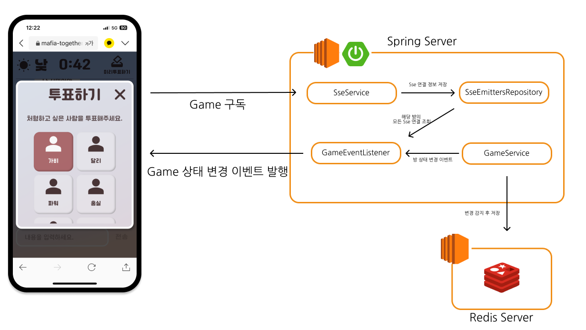

# 서론
기존 마피아 투게더 게임은 실시간 통신을 `Polling`을 통해 구현해 두었다
그 이유는 러닝 커브, 구현 속도가 다른 기술에 비해 빠르게 때문에 선정하게 되었다.
`Polling`의 시나리오는 이렇다

1. 매 0.5초 마다 방의 상태를 물어봄
2. 방의 기록된 현재 상태의 기한 (endtime)과 현 시간을 비교하고 지났을 경우 상태를 변경하여 방 상태를 응답 그렇지 않을 경우 지금 방 상태 반환

이 경우 총 유저의 수만큼 초당 2번씩 요청이 오게 된다
이렇게 될경우 유저가 많아질 수 록 서버의 부담이 높아질 것으로 예상된다
따라서 `Polling`의 실시간 통신 부분을 교체하기로 하였다

# 기술 선정
실시간 기술에는 여러 종류가 있다
`Polling`, `Long Polling`, `SSE`, `Web Socket`, `Web RTC` 등등
각각을 보자면

## Polling
- 요청을 주기적으로 보냄
- Http 요청/응답 구조를 그대로 사용 가능
- 구현 난이도가 쉬움
- 서버에 불필요한 요청이 발생하고 응답 지연이 발생

## Long Polling
- 보낸 요청에서 응답이 발생할때까지 연결을 유지하며 대기
- Http 요청/응답 구조를 그대로 사용 가능
- 연결 유지에 의한 서버 리소스 발생

## SSE
- 클라이언트가 서버에 연결을 하면 서버에서 이벤트가 발생할 때마다 응답
- Http의 event streaming 사용
- 서버에서 다수의 클라이언트에게 메세지를 쉽게 브로드케스팅할 수 있음
- 단방향 통신 server -> client

## WebSocket
- 양방향 통신 프로토콜
- 영구적인 연결을 유지
- ***WebSocket 핸드셰이크***를 통해 서버와 연결
- 초기 연결이 Http보다 복잡

## WebRTC
- 실시간 미디어 스트리밍 및 데이터 전송을 위한 프로토콜
- P2P 방식
- 중간 서버를 거치지 않음
- 중간 서버가 없어 네트워크 지연 시간이 적음
- P2P 통신은 방화벽 및 NAT 설정에 따라 차단될 . 수있으며 시그널링 서버를 설정해야함


|        | Polling | Long Polling | SSE  | Web Socket | Web RTC |
| ------ | ------- | ------------ | ---- | ---------- | ------- |
| 통신방향   | 단방향     | 단방향          | 단방향  | 양방향        | 양방향     |
| 프로토콜   | Http    | Http         | Http | ws         | P2P     |
| 구현 난이도 | 매우 쉬움   | 쉬움           | 중간   | 복잡         | 복잡      |
| 서버 부담  | 매우 큼    | 큼            | 보통   | 보통         | 낮음      |

방 상태의 경우 단순하게 서버에서 변경해주므로 방상태 변경시에만 이벤트를 발행해주면됨

단방향 통신만으로 충분한 부분이고 `WebSocket`이나 `WebRTC`의 경우 복잡하므로 **SSE**를 선택
또한 `Web RTC`의 경우 게임 방 상태를 서버에서 관리하지 못하고 클라이언트에 맡겨야한다는 점이 적합하지 않다고 판단했다

# 설계
`Pub/Sub` 구조와 유사하게 가져가고 싶다는 생각이 들었다
처음에는 `Redis`에 `SSE emitters` 를 객체 저장하면 가능할 줄 알았지만
`SSE`의 경우 `Http`를 유지하여야하고 해당 `SSE` 연결이 끊길 경우 저장된 `SSE` 가져와서 보낸다고 보내지는 것이 아니다
따라서` Session` 처럼 각 서버에서 연결을 유지하고 방 상태 변경이라는 메시지를 발행 구독하는 구조가 적합하다는 생각이 들었다 (우린 추후에 `scale out`을 하던 모듈을 나누어 분산구조로 바꾸던 할 계획이라 `PUB/SUB` 처럼 서버간 메시지를 뿌릴 구조가 필요했다)

하지만 기존 `WebSocket`으로 구현하면서 `STOMP` 프로토콜을 사용하게 되었고 이 과정에서 `Spring`의 `MessageListener`(`redis`의 `pub/sub` 메시지 발행을 듣는 객체)를 사용하게 됬다. 멀티 모듈로 분리하게 된다면 `MessageListener`가 필요한 각 모듈에서 생성되겠지만 현재 구조에서 `MessageListener`를 같이 사용할 경우 의존성이 깨지게 된다고 판단하였다.

따라서 최대한 `Pub/Sub` 구조에 용이하게 구현하되 현재는 `Redis`를 통한 `Publishing`을 제외하고 구현하기로 하였다.



그리하여 생각한 구조가 이것이다.
게임 구독시 `SseEmittersRepository`에 `SSE` 연결을 저장하고 (Session) `GameService`에 의해 상태가 변경 될때 마다 이벤트를 발행하여 `GameEventListener`에서 해당 방의 `SSE`연결을 가져와 뿌려주는 것이다.

추후 PUB/SUB 구조로 바뀐다면 해당 부분이 `MessageListener`의 역할이 될것이다.

그렇담 Game 상태의 변경의 trigger는 어떻게 되는 것일까? 이전 `Polling`의 경우 매초 요청이 들어오기 때문에 걱정할 필요가 없었다. 하지만 이제 그런 trigger가 없으니 매초마다 검사를 해줘야한다
이 부분은 `Spring`의 `scheduler`를 활용했다.
매 0.5초마다 방을 검사하여 시간이 지난 방이 있는지 검사하고 방 상태 변경후 이벤트를 발행해 주었다.

# 구현
구현 자체는 단순하다
```java
@GetMapping(path = "/subscribe", produces = MediaType.TEXT_EVENT_STREAM_VALUE)  
@SseSubscribe  
public ResponseEntity<SseEmitter> subscribe(@PlayerInfo final PlayerInfoDto playerInfoDto) {  
    return ResponseEntity.ok(new SseEmitter());  
}
```
구독 시 `MediaType.TEXT_EVENT_STREAM_VALUE` 으로 요청을 오게하였다
하지만 이상태에서 `SseEmitter`만 주게 하지 않았다 `@Aspect`를 통해 반환값을 바꿨다
그 이유는 뭔가 통신 연결이라는 부분을 service단계까지 낮추고 싶지 않았고 이를 따로 관리하는 것이 맞을 것 같앗다.
그래서 `@SseSubscibe`라는 어노테이션을 통해 `aspect`를 구현했다

```java
@Around("@annotation(mafia.mafiatogether.game.annotation.SseSubscribe)")  
public ResponseEntity<SseEmitter> subscribe(final ProceedingJoinPoint joinPoint) throws Throwable {  
    MethodSignature methodSignature = (MethodSignature) joinPoint.getSignature();  
    Method method = methodSignature.getMethod();  
  
    Annotation[][] parameterAnnotations = method.getParameterAnnotations();  
    Object[] args = joinPoint.getArgs();  
  
    String[] codeAndName = new String[2];  
    for (int i = 0; i < parameterAnnotations.length; i++) {  
        if (hasPlayerInfo(parameterAnnotations[i])) {  
            PlayerInfoDto playerInfoDto = (PlayerInfoDto) args[i];  
            codeAndName[0] = playerInfoDto.code();  
            codeAndName[1] = playerInfoDto.name();  
            break;  
        }  
    }  
  
    if (codeAndName[0] == null || codeAndName[1] == null) {  
        throw new AuthException(ExceptionCode.INVALID_AUTHENTICATION_FORM);  
    }  
  
    SseEmitter sseEmitter = createSseEmitter(codeAndName[0], codeAndName[1]);  
    sseEmitterRepository.save(codeAndName[0], codeAndName[1], sseEmitter);  
    return ResponseEntity.ok(sseEmitter);  
}
```

해당 어노테이션이 있는 메서드에서 `@PlayerInfo`를 찾고 이를 가져오는 메서드다.

제일 중요한 부분은 `createSseEmitter(code, name);`
이다
```java
private SseEmitter createSseEmitter(String code, String name) throws IOException {  
    SseEmitter sseEmitter = new SseEmitter(HOURS_12);  
    sseEmitter.send(getSseEvent(code));  
    sseEmitter.onCompletion(() -> sseEmitterRepository.deleteByCodeAndEmitter(code, name));  
    sseEmitter.onTimeout(sseEmitter::complete);  
    return sseEmitter;  
}
```
이 부분이 `sseEmitter.onCompletion(() -> )`  의 경우 해당 에미터가 완료되었을때 메서드를 실행시키라는 뜻이다.
```
Register code to invoke when the async request completes. This method is called from a container thread when an async request completed for any reason including timeout and network error. This method is useful for detecting that a ResponseBodyEmitter instance is no longer usable.
```
해당 메서드의 해석을 보면 입력한 람다식을 비동기 적으로 호출하여 실행을 해준다.
이때 우리는 session에 있는 `sse`를 제거해주는 메서드를 넣어놓았다.
또한 timeout 놨을때도 onComplete이 일어나게 해두었다.

이것을 통해 연결 관리를 service에서 분리해두었다. (개인적으로 해당 aspect 네이밍을 service가 아닌 aspect로 바꾸고 싶엇지만 이미 다른 aspect를 service로 명명해두어서 통일감있게 갔다)

# Nginx

구현한 `SSE`는 local에서 잘 돌아갔지만 실재 `AWS` 환경에서는 돌아가지 않았다.
그 이유를 찾아보니 `Nginx`가 원인이었다.
SSE 는 지속연결을 사용하는 `http/1.1`을 사용한다
하지만 `Nginx`를 통할때에는 `Http/1.0`을 사용한다. 또한 `Connect : close`를 통해 통신을 끊어버리기 때문에 지속연결이 불가능하다 따라서 이에대한 설정이 필요하다

```
location /api/games/subscribe {
	
	# 들어온 요청을 api를 빼고 다시 적음
    rewrite ^/api(.*) $1 break; 
	
	# 들어온 요청을 docker 밖의 localhost로 돌림
    proxy_pass http://172.17.0.1:8080; 

	# host의 헤더를 설정해줌
    proxy_set_header Host $host; 
    
    # 실제 ip를 헤더 넣어둠
    proxy_set_header X-Real-IP $remote_addr;
    
	# Connection 'close'를 방지
	proxy_set_header Connection '';
	
    # 클라이언트가 프록시나 서버에서 데이터를 캐싱하지않도록 지시
    proxy_set_header Cache-Control 'no-cache';
    
    # Nginx 내부 버퍼에 데이터를 저장하지 않음
    proxy_set_header X-Accel-Buffering 'no'; 
    
    # SSE의 Content Type인 text/event-stream을 사용 
    proxy_set_header Content-Type 'text/event-stream'; 
    
    # 프록시 버퍼링 끄기 
    proxy_buffering off;
    
    # Http응답을 일정한 크기의 청크로 나누어 전송 
    #-> 데이터의 전체크기를 모를때 사용 
    #-> 서버에 클라이언트로 지속적으로 스트리밍 데이터를 전송
    chunked_transfer_encoding on;
    
    # Nginx가 백엔드 서버로부터 응답을 기다리는 시간을 24시간으로
    proxy_read_timeout 86400s;
  }
```

# To-do
- [ ] PUB/SUB 구조 적용


# 참고
[Nginx Stackover flow 내용](https://stackoverflow.com/questions/46771389/why-does-nginx-proxy-pass-close-my-connection)

[SSE](https://velog.io/@michaelp3/Spring%EC%9D%98-SSE)
