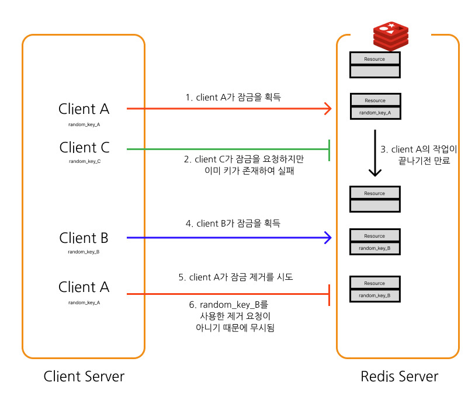
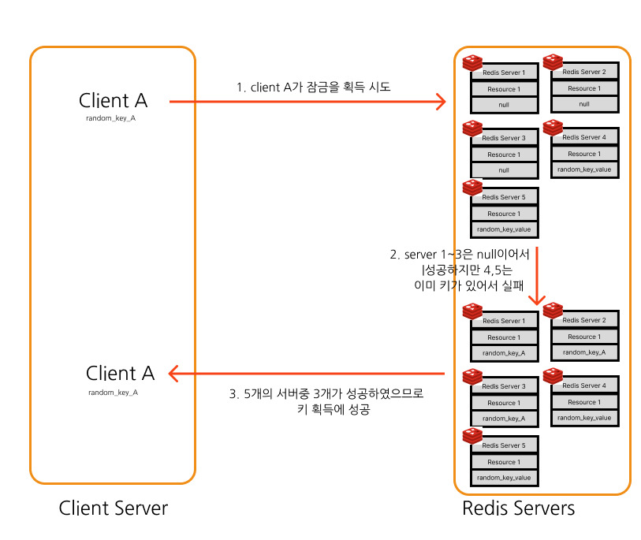

# 서론
마피아 투게더를 개발하면서 Redis를 도입하였었다.
Redis를 도입한 이유는 다음과 같다
1. JVM 내부 세션 방식으로 관리하는 것보다 분산환경에 더 유연하게 설계 가능
2. RDBMS보다 더 빠른 인메모리 DB

하지만 여러가지 문제에 봉착하게 되었다.

바로 동시성 문제에 봉착한 것이다.

대표적인 예시로
동시에 A, B가 마지막 멤버로 들어오면서 A가 사소한 차이로 먼저 들어왔을때


A의 입장 요청이 B의 `findRoom(참여인원 정보)`보다 먼저 들어갈 경우  방의 입장정보를 계속 받고 있던 다른 유
저는 마지막 유저가 A -> B로 바뀌는 동시성 이슈를 맛보게 될것이다.

또한 DB(Redis)에는 해당 테이블에 먼저 입장한 A가 아닌 B가 최종적으로 저장되게 된다.

이러한 문제는 `@Transactional`로 격리하여 해결할 수 있을 줄 알았지만 Redis는 기본적으로 트랜잭션을 보장 하지 않기 때문에 문제가 발생하게 되었다.

# Redis 세팅하기

코드 : [Lock을 구현안한 예제 코드 Repo](https://github.com/waterricecake/redis-lock/tree/no-lock)

테스트를 위해 `testContainer` (local의 Redis 건들기 싫어서와 redis를 추가해주었다)

```gradle
implementation 'org.springframework.boot:spring-boot-starter-data-redis'  
testImplementation 'org.testcontainers:testcontainers'
```

## 테스트 환경 구축하기
`@TestConfiguration`으로 테스트 환경에서만 테스트 설정
```java
@TestConfiguration  
public class RedisTestConfig {  
  
    private static final String REDIS_DOCKER_IMAGE = "redis";  
  
    static {  
        GenericContainer<?> REDIS_CONTAINER = new GenericContainer<>(DockerImageName.parse(REDIS_DOCKER_IMAGE))  
                .withExposedPorts(6379)  
                .withStartupTimeout(Duration.ofSeconds(60))  
                .withReuse(true);  
  
        REDIS_CONTAINER.start();  
  
        System.setProperty("spring.data.redis.host", REDIS_CONTAINER.getHost());  
        System.setProperty("spring.data.redis.port", REDIS_CONTAINER.getMappedPort(6379).toString());  
    }  
}
```

## `RedisConfig` 설정하기
```java
@Configuration  
@EnableRedisRepositories  
public class RedisConfig {  
  
    @Value("${spring.data.redis.host}")  
    private String host;  
  
    @Value("${spring.data.redis.port}")  
    private int port;  
  
    @Bean  
    public RedisConnectionFactory redisConnectionFactory() {  
        return new LettuceConnectionFactory(host, port);  
    }  
}
```

## Repository 및 Service와 Entity
- 객체
```java
@RedisHash("person")  
@Getter  
@Setter  
@AllArgsConstructor  
public class Person {  
  
    @Id  
    private Long id;  
    private String name;  
    private int age;  
}
```
- Repo
```java
public interface PersonRepository extends CrudRepository<Person, Long> {  
}
```
- Service
```java
@Service  
@RequiredArgsConstructor  
public class PersonService {  
  
    private final PersonRepository personRepository;  
  
    @Transactional  
    public Person getPersonById(Long id) {  
        return personRepository.findById(id).orElse(null);  
    }  
  
    @Transactional  
    public Person savePerson(Person person) {  
        return personRepository.save(person);  
    }  
  
    public void waitAndUpdateById(long id, int age) throws InterruptedException {  
	    // 0.1초 대기후 실행
        Thread.sleep(100);  
        Person person = personRepository.findById(id).orElse(null);  
        person.setAge(age);  
        personRepository.save(person);  
    }  
}
```


# Transaction 이 보장이 안됨
```java
@Import(RedisTestConfig.class)  
@SpringBootTest(webEnvironment = SpringBootTest.WebEnvironment.NONE)  
class PersonServiceTest {  
  
    @Autowired  
    private PersonService personService;  
  
    @Test  
    @DisplayName("레디스에서 읽기에 대한 락이 보장되지 않는다.")  
    void failWithConcurrencyIssue() throws InterruptedException {  
        // given  
        final int expect = 12;  
        final Person person = new Person(1L, "철수", 10);  
        personService.savePerson(person);  
        ExecutorService executorService = Executors.newFixedThreadPool(2);  
        CountDownLatch countDownLatch = new CountDownLatch(2);  
  
        // when  
        executorService.execute(  
                () -> {  
                    try {  
                        personService.waitAndUpdateById(person.getId(), expect);  
                    } catch (InterruptedException e) {  
                        throw new RuntimeException(e);  
                    } finally {  
                    countDownLatch.countDown();  
                    }  
                }  
        );  
  
        executorService.execute(  
                () -> {  
                    person.setAge(11);  
                    personService.savePerson(person);  
                    countDownLatch.countDown();  
                }  
        );  
  
        // then  
        countDownLatch.await();  
        final Person actual = personService.getPersonById(person.getId());  
        assertThat(actual.getAge()).isEqualTo(expect);  
    }  
}
```

위 시나리오는 기존 `person`의 `age`를 12로 먼저 바꾸는 먼저 실행한 이후 11로 바꾸는 시나리오이다.

만약 격리가 제대로 됬다면 후에 입력된 11이 되는것이 옳지만 `thread.sleep(100)`을 통해
`waitAndUpdate`를 지연시켰다.

이로 인해 트렌젝션이 보장이 되지 않아 먼저 입력한 12가 되는 현상을 볼수 있다.

이는 DB 격리 수준인 `Read Uncommited`에서 일어나는 `Dirty Read`가 일어날 수 있다.

# Redis의 분산락
레디스에서는 이러한 동시성 문제를 해결하기 위해 DLM (Distributed Lock Manager)만들어 두었다.

`RedLock`은 Redis에서 제안한 공식적인 DLM 알고리즘이다.

## 단일 레디스 인스턴스에서의 알고리즘

우선 단일 인스턴스에서의 알고리즘을 알아보자



다음은 키를 설정하는 방법이다.

```
SET resource_name my_random_value NX PX 30000
```

`resource_name` : 접근 키를 얻을려고 하는 대상
`my_random_value` : 랜덤 value의 접근 키
`PX 30000` : 만료 시간을 의미한다 (ms)

여기서 중요한 것은 바로 `NX'이다

### NX 옵션
`NX` 옵션은 대상(`resource_name` )에 키(`my_random_value`)가 존재하지 않을때 에만 이 명령어를 키를 설정하라는 의미이다.

이럴 경우 이미 키가 있는 경우 (그러니까 다른 트랜젝션이 이 리소스에 접근을 하고 있을때) 키가 설정이 되지 않아 잠금을 구현할 수 있게 되는 것이다.

해당 키를 제거할때 Lua 스크립트를 통해
```
if redis.call("get",KEYS[1]) == ARGV[1] then
    return redis.call("del",KEYS[1])
else
    return 0
end
```
해당 키 (`my_random_value`)가 존재 할시 제거를 진행하고 아닐 경우 무시하게 한다.

이때 `my_random_value`는 고유해야한다. 예를들어, 클라이언트 A가 리소스에 접근하여 잠금을 획득한 이후 만료시간 이후까지 차단 당하여 다른 클라이언트 B가 잠금을 획득한 경우 클라이언트 A가 다시 작동하여 클라이언트 B의 잠금을 제거하는 불상사를 방지할 수 있다.


## 레드락 알고리즘
다음은 이제 분산환경 (`Redis도 분산환경, 여러개의 Redis 마스터`)의 알고리즘에 대한 설명이다.

이 알고리즘의 경우 위의 단일 레디스 인스턴스의 잠금을 사용한다는 가정으로 시작한다.

N개의 Redis 인스턴스가 있다고 가정할 경우

1. 현재의 시간을 밀리초로 저장한다.
2. 모든 N개의 인스턴스에 순차적으로 잠금 획득을 시도

   또한 모든 인스턴스에 사용되는 키와 random 값은 동일해야한다.

   이때 한 인스턴스 획득잠금 획득을 위한 요청의 만료 시간은 총 인스턴스 잠금 획득 요청에 비해 매우 작은 시간으로 설정해야 한다.
   이는 실패시 다음 인스턴스와 통신을 하여 다운된 Redis노드와의 통신에 의한 병목현상을 방지한다
3. 1단계에서 얻은 밀리초와 현재 시간을 통해 잠금 획득 시간을 계산, 클라이언트 대부분의 인스턴스(N/2 + 1)에서 잠금을 획득하고서 걸린 총 시간이 잠금 유효 시간보다 짧은 경우 잠금 획득
4. 잠금을 획득한 경우 유효 시간은 초기 유효시간 - 경과시간
5. 잠금을 실패 한 경우 모든 인스턴스(잠금 획득에 실패한 인스턴스 포함)에서 잠금을 해제

#### 획득하는 경우



#### 실패하는 경우


# 안정성
잠금을 획득하는 경우가 모든 인스턴스에 대하여 N/2 + 1개에서 성공을 해야함 획득하기 때문에 동일한 리소스에 대하여 획득을 하는 경우는 없게 된다. 이를 통해 동시에 키 획득에 성공한 경우를 방지 할 수 있게 된다.

# 한계
## 모든 인스턴스의 시간이 동일하다고 가정
```
The algorithm relies on the assumption that while there is no synchronized clock across the processes, the local time in every process updates at approximately at the same rate, with a small margin of error compared to the auto-release time of the lock.
이 알고리즘은 프로세스 간에 동기화된 클록이 없지만 모든 프로세스의 로컬 시간은 거의 같은 속도로 업데이트되고 잠금의 자동 해제 시간과 비교했을 때 오차 범위가 작다는 가정에 의존합니다.
```
이 알고리즘은 분산 레디스에서 동기화된 클록 없이 모든 프로세스의 로컬 시간이 거의 같은 속도로 업데이트 된다는 가정에 의존하게 된다.

실제 환경에서는 클럭 드리프트 (Clock Drift)에 의해 각 인스턴트의 시간이 변할 수 있다. 이는 다음과 같은 시나리오를 만들어 낼 수 있다.


# 참고
[Distributed Locks with Redis](https://redis.io/docs/latest/develop/use/patterns/distributed-locks/)
