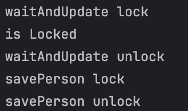
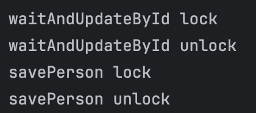
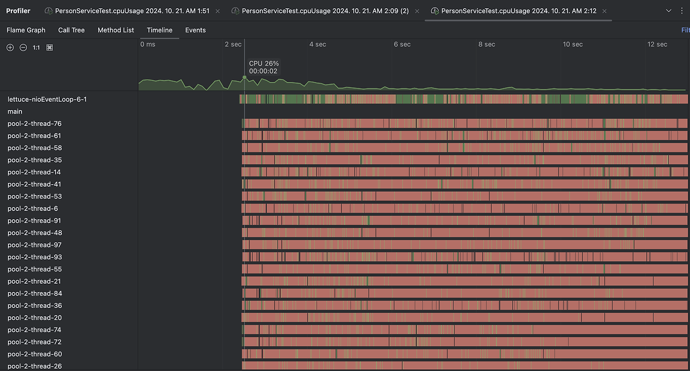
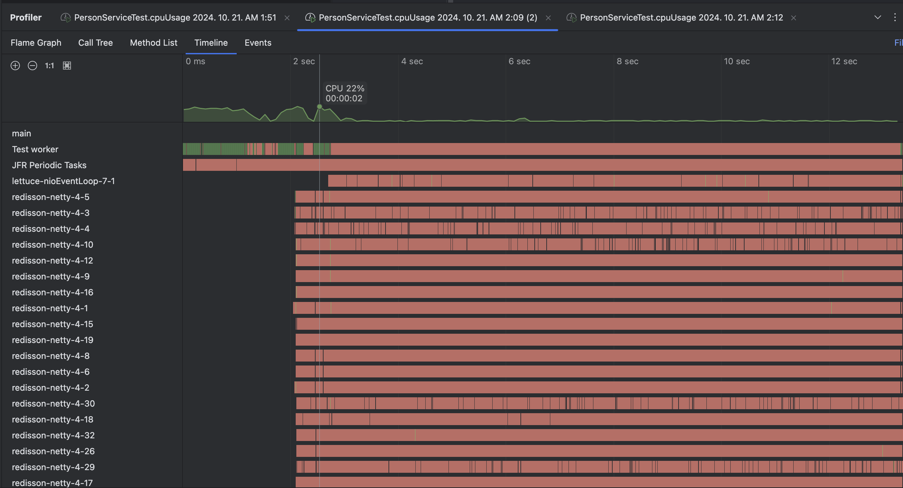

# 읽기 전에

[Redis의 락](../redis-lock)

레디스의 락에 대해서 정리한 글이다

# Spring의 Redis Framework
Spring의 레디스 프레임 워크는 크게 3가지가 있다.

`Jedis` , `Lettuce`, `Redisson`
이렇게 있다.

- `Jedis`
  Redis 동기식 Java 클라이언트, 비교적 간단하고 쉽다
- `Lettuce`
  Redis 비동기 및 반응형 연결 Java 클라이언트, `netty` (자바 비동기 이벤트 기반 네트워크 애플리케이션)기반으로 이루어져 있다
- `Reddison`
  netty 기반의 고성능 비동기 및 락프리 Java 클라이언트, 락프리란 락을 사용하지 않고도 공유 자원에 대하여 여러 스레드 접근시 데이터의 일관성을 보장하는 프로그래밍 기법


## Jedis
Redis 용 비 동기식 Java 클라이언트라고 설명하며 비교적 간단하고 쉽게 사용할 수 있다.

## Lettuce

Redis 비동기 및 반응형 연결 Java 클라이언트

`netty` (자바 비동기 이벤트 기반 네트워크 어플리케이션) 기반으로 이루어져 있다

[Redis](https://redis.io/docs/latest/develop/connect/clients/java/lettuce/)문서에 따르면 동기식 연결만 필요한 경우 `Jedis`를 추천하며 비동기 및 반응형 연결이 필요하다면 `Lettuce`를 사용하라고 추천한다.

## Reddison
고성능 비동기 및 락프리 Java 클라이언트

락프리란 락을 사용하지 않고도 멀티 스레드 환경에서 데이터의 일관성을 보장하는 프로그래밍 기법을 의미한다

|            | Jedis     | Lettuce   | Redisson  |
| ---------- | --------- | --------- | --------- |
| 동기/ 비동기    | 동기        | 비동기       | 비동기       |
| 기반         | -         | netty     | netty     |
| 분산 락 기능 제공 | x         | x         | O         |
| 락 구현 방식    | spin lock | spin lock | lock-free |

Jedis의 경우 이러한 비동기 환경이나 락환경 자체를 고려하지 않는 경우 가볍게 사용하는 라이브러리이므로 제외하고 그외의 `Lettuce`와 `Redisson`의 Lock 구현에 사용해볼 라이브러리이다.

# Lettuce 락 구현하기
Lettuce로 락을 구현할 경우 기능을 따로 제공하지 않기 때문에 Spin Lock으로 구현을 한다.

Spin Lock이란 일종의 polling이라고 생각하면된다.

lock이 걸려있는 공유 자원에 접근시 해당 키가 풀릴때까지 주기적으로 접근을 시도하여 lock을 얻는 방식이다.

lock 자체는 앞서 레디스가 제공한 `Redlock`을 사용하였다. (단일 레디스 인스턴스)
## Redlock 구현

```java
@Component  
@RequiredArgsConstructor  
public class RedisLockRepository {  
    private final RedisTemplate<String, Object> redisTemplate;  
    private static final String UNLOCK_SCRIPT =  
            """  
            if redis.call("get",KEYS[1]) == ARGV[1] then
                return redis.call("del",KEYS[1])            
            else                
	            return 0           
	        end           
	        """;  
  
    public Boolean lock(String resource, String key, long timeout ) {  
        return redisTemplate.opsForValue()  
                .setIfAbsent(resource, key, Duration.ofMillis(timeout));  
    }  
  
    public Boolean unlock(String resource, String key) {  
        DefaultRedisScript<Long> redisScript = new DefaultRedisScript<>();  
        redisScript.setScriptText(UNLOCK_SCRIPT);  
        redisScript.setResultType(Long.class);  
  
        Long result = redisTemplate.execute(redisScript, Collections.singletonList(resource), key);  
        return result != null && result == 1;  
    }  
}
```

이 레포는 레디스의 락을 관리하는 레포이다.

### lock()
```
SET resource key NX PX timeout
```
이 명령어를 실행시켜 주는 함수이다.
`setIfAbsent()`가 NX 옵션의 `SET` 명령어이다.


### unlock
```
if redis.call("get",KEYS[1]) == ARGV[1] then
    return redis.call("del",KEYS[1])            
else                
	return 0           
end     
```
이 Lua 스크립트를 실행시켜주는 함수이며
해당 스크립트는 존재할 경우 지우며 아닐 경우 무시하라는 명령어이다.

## Spin Lock 적용
```java
@Service  
@RequiredArgsConstructor  
public class PersonService {  
  
    private final PersonRepository personRepository;  
    private final RedisLockRepository redisLockRepository;  
  
    @Transactional  
    public Person getPersonById(Long id) throws InterruptedException {  
        String key = getLock(String.valueOf(id));  
        System.out.println("getPersonById lock" );  
        Person person = personRepository.findById(id).orElse(null);  
        unlock(String.valueOf(id), key);  
        System.out.println("getPersonById unlock" );  
        return person;  
    }  
  
    @Transactional  
    public Person savePerson(Person person) throws InterruptedException {  
        String key = getLock(String.valueOf(person.getId()));  
        System.out.println("savePerson lock" );  
        Person savedPerson = personRepository.save(person);  
        unlock(String.valueOf(person.getId()), key);  
        System.out.println("savePerson unlock" );  
        return savedPerson;  
    }  
  
    @Transactional  
    public void waitAndUpdateById(long id, int age) throws InterruptedException {  
        String key = getLock(String.valueOf(id));  
        System.out.println("waitAndUpdate lock");  
        Thread.sleep(100);  
        Person person = personRepository.findById(id).orElse(null);  
        person.setAge(age);  
        personRepository.save(person);  
        unlock(String.valueOf(id), key);  
        System.out.println("waitAndUpdate unlock");  
    }  
  
    private String getLock(final String id) throws InterruptedException {  
        String key = "random_value_" + id; // 실제로는 유니크한 랜덤값을 집어넣어야함  
        while (Boolean.FALSE.equals(redisLockRepository.lock(id, key, 30_000L))) {  
            System.out.println("is Locked");  
            Thread.sleep(1000);  
        }  
        return key;  
    }  
  
    private void unlock(final String id, final String key) {  
        redisLockRepository.unlock(id, key);  
    }  
}
```
스핀락을 구현한 `getLock` 에서는 키 획득이 성공할때까지 1초간격으로 계속 물어보게 설계되었다.

획득이후 작업이 끝났을때 `unlock`을 호출하여 잠금을 해제하게 설계하였다.

## 테스트
```java
@Import(RedisTestConfig.class)  
@SpringBootTest(webEnvironment = SpringBootTest.WebEnvironment.NONE)  
class PersonServiceTest {  
  
    @Autowired  
    private PersonService personService;  
  
    @Test  
    @DisplayName("Spin lock에 의해 순서대로 처리된다")  
    void failWithConcurrencyIssue() throws InterruptedException {  
        // given  
        final int expect = 12;  
        final Person person = new Person(1L, "철수", 10);  
        personService.savePerson(person);  
        ExecutorService executorService = Executors.newFixedThreadPool(2);  
        CountDownLatch countDownLatch = new CountDownLatch(2);  
  
        // when  
        executorService.execute(  
                () -> {  
                    try {  
                        personService.waitAndUpdateById(person.getId(), 11);  
                    } catch (InterruptedException e) {  
                        throw new RuntimeException(e);  
                    } finally {  
                    countDownLatch.countDown();  
                    }  
                }  
        );  
  
        executorService.execute(  
                () -> {  
                    person.setAge(expect);  
                    try {  
                        personService.savePerson(person);  
                    } catch (InterruptedException e) {  
                        throw new RuntimeException(e);  
                    }  
                    countDownLatch.countDown();  
                }  
        );  
  
        // then  
        countDownLatch.await();  
        final Person actual = personService.getPersonById(person.getId());  
        assertThat(actual.getAge()).isEqualTo(expect);  
    }  
}
```

결과 나중에 입력한 12살이 적용되게 된다

또한 잠금이 되었는지 확인하기 위한 출력값을 보면



`waitAndUpdate()`이 호출된 이후 잠금이 되어 `savePerson()` 은 대기하게되고 `waitAndUpdate()`가 잠금 해제시 `savePerson()`가 잠금을 성공하게 되는 것을 볼 수 있다.

spin lock의 경우 구현 난이도는 간단하지만 락 획득 할때까지 주기적으로 계속 레디스 서버와 연결을 해야하므로 그만큼 불필요한 요청을 계속 보내게 된다.


# Redisson 락 구현하기

`Redisson`은 `Pub/Sub`구조로 이루어져 있어 Spin Lock과는 다르게 락을 획득할때까지 주기적으로 Redis와 통신하지 않고 Redis에서 Lock이 풀리는 순간 구독하고있는 쓰레드들에게 Lock 획득 시도를 하라는 이벤트를 발행하게 된다.

`Redisson`은 `Jedis`나 `Lettuce`와는 다르게 `Spring data Redis` 에 없어서 따로 의존성을 추가해줘야한다.
```gradle
implementation 'org.redisson:redisson-spring-boot-starter:3.17.4'
```

## RedisConf
```java
@Configuration  
@EnableRedisRepositories  
public class RedisConfig {  
  
    @Value("${spring.data.redis.host}")  
    private String host;  
  
    @Value("${spring.data.redis.port}")  
    private int port;  
  
    private static final String REDISSON_HOST_PREFIX = "redis://";  
  
    @Bean  
    public RedissonClient redissonClient() {  
        Config config = new Config();  
        config.useSingleServer().setAddress(REDISSON_HOST_PREFIX + host + ":" + port);  
        return Redisson.create(config);  
    }  
}
```

## RedisService
```java
@Service  
@RequiredArgsConstructor  
public class PersonService {  
  
    private final PersonRepository personRepository;  
    private final RedissonClient redissonClient;  
  
    @Transactional  
    public Person getPersonById(Long id) {  
        RLock lock = getLock(String.valueOf(id));  
        System.out.println("getPersonById lock");  
        Person person = personRepository.findById(id).orElse(null);  
        lock.unlock();  
        System.out.println("getPersonById unlock");  
        return person;  
    }  
  
    @Transactional  
    public Person savePerson(Person person) {  
        RLock lock = getLock(String.valueOf(person.getId()));  
        System.out.println("savePerson lock");  
        Person savedPerson = personRepository.save(person);  
        lock.unlock();  
        System.out.println("savePerson unlock");  
        return savedPerson;  
    }  
  
    public void waitAndUpdateById(long id, int age) throws InterruptedException {  
        RLock lock = getLock(String.valueOf(id));  
        System.out.println("waitAndUpdateById lock");  
        Thread.sleep(100);  
        Person person = personRepository.findById(id).orElse(null);  
        person.setAge(age);  
        personRepository.save(person);  
        lock.unlock();  
        System.out.println("waitAndUpdateById unlock");  
    }  
  
    private RLock getLock(String key) {  
        RLock lock = redissonClient.getLock(key);  
        boolean isLocked;  
        try {  
            isLocked = lock.tryLock(15, 30, TimeUnit.SECONDS);  
        } catch (InterruptedException e) {  
            throw new RuntimeException("락을 획득하는 중 오류 발생", e);  
        }  
  
        if (!isLocked) {  
            throw new IllegalStateException("락을 획득할 수 없습니다: " + key);  
        }  
        return lock;  
    }  
}
```

위에서 `lock.try()`함수는 lock 획득을 시도하고 만약 실패할 경우 redis에 subscribe하여 해당 자원의 lock이 해제될때 이벤트를 발행받고 Lock획득을 다시 시도하게 된다.

## 테스트

```java
@Service  
@Import(RedisTestConfig.class)  
@SpringBootTest(webEnvironment = SpringBootTest.WebEnvironment.NONE)  
class PersonServiceTest {  
  
    @Autowired  
    private PersonService personService;  
  
    @Test  
    @DisplayName("Redisson을 통한 Lock 구현")  
    void failWithConcurrencyIssue() throws InterruptedException {  
        // given  
        final int expect = 12;  
        final Person person = new Person(1L, "철수", 10);  
        personService.savePerson(person);  
        ExecutorService executorService = Executors.newFixedThreadPool(2);  
        CountDownLatch countDownLatch = new CountDownLatch(2);  
  
        // when  
        executorService.execute(  
                () -> {  
                    try {  
                        personService.waitAndUpdateById(person.getId(), 11);  
                    } catch (InterruptedException e) {  
                        throw new RuntimeException(e);  
                    } finally {  
                    countDownLatch.countDown();  
                    }  
                }  
        );  
  
        Thread.sleep(10);  
  
        executorService.execute(  
                () -> {  
                    person.setAge(expect);  
                    personService.savePerson(person);  
                    countDownLatch.countDown();  
                }  
        );  
  
        // then  
        countDownLatch.await();  
        final Person actual = personService.getPersonById(person.getId());  
        assertThat(actual.getAge()).isEqualTo(expect);  
    }  
}
```
위 와 마찬가지로



lock 되는 것을 확인해 볼 수 있다.

# 비교
각 경우에 대해서 CPU의 사용량이 어떤지 테스트 해봤다.

```java
    @Test  
    @DisplayName("성능 테스트")  
    void cpuUsage() throws InterruptedException {  
        final Person person = new Person(1L, "철수", 10);  
        personService.savePerson(person);  
        int count = 100;  
        ExecutorService executorService = Executors.newFixedThreadPool(count);  
        CountDownLatch countDownLatch = new CountDownLatch(count);  
        AtomicInteger atomicInteger = new AtomicInteger(0);  
        for (int i = 0; i < count; i++) {  
            executorService.execute(  
                    () -> {  
                        try {  
                            personService.waitAndUpdateById(person.getId(), atomicInteger.get());  
                            atomicInteger.getAndIncrement();  
                        } catch (InterruptedException e) {  
                            atomicInteger.incrementAndGet();  
                            throw new RuntimeException(e);  
                        } finally {  
                            countDownLatch.countDown();  
                        }  
                    }  
            );  
        }  
        countDownLatch.await();  
        Assertions.assertThat(atomicInteger.get()).isEqualTo(count);  
    }  
}
```

100개에 대하여 (속도를 위해서 Lettuce에서 재요청을 위한 대기시간을 제거하였다)

## Lettuce



- 테스트 시작 이후 최고 사용량 26% ~ 28%

## Redisson



- 테스트 시작 이후 최고 사용량 21%~22%


물론 완전 동일한 상태에서의 테스트는 아니지만 100번의 요청에 대해서 (경쟁상태를 만들기 위해서 sleep을 사용하면서 테스트 시간이 늘어날 것으로 예상해 작은 값으로 진행했다) 4%의 차이는 크다고 생각한다.

따라서 공유 자원에 대해서 경쟁 상태가 자주 일어날 것으로 예상이 된다면 Redisson이 효율적일 것이라고 생각한다.
# 참고
[Jedis 공식 문서](https://redis.io/docs/latest/develop/connect/clients/java/jedis/#connect-using-client-side-caching)
[Lettuce 공식 문서](https://redis.io/docs/latest/develop/connect/clients/java/lettuce/)
[Redisson vs Lettuce](https://redisson.org/feature-comparison-redisson-vs-lettuce.html)
[레디스와 분산 락(1/2) - 레디스를 활용한 분산 락과 안전하고 빠른 락의 구현](https://hyperconnect.github.io/2019/11/15/redis-distributed-lock-1.html)

