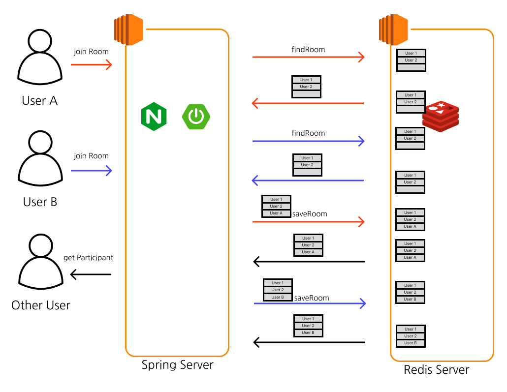
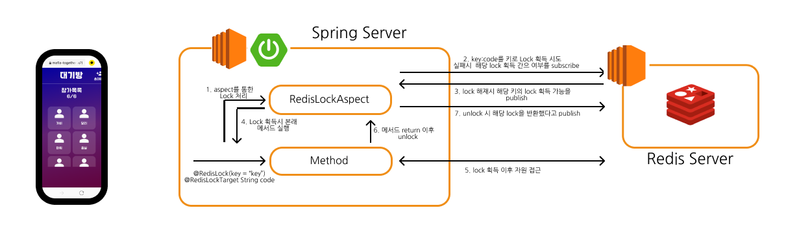

# 읽기 전에
[Redis Lock 기본](../redis-lock)

[Redisson vs Lettuce](../java-redis-lock)

# 서론
위 글에서 적은 동시성 이슈를 해결하기 위해 Redisson을 도입한 Redis 락을 구현하게 되었다.

발생 할 수 있는 이슈는 한자리 남음 방에 동시 입장할때 발생할 수 있다고 생각했다.



1. User A와 User B가 동시에 방에 참가한다
2. User A와 User B가 거의 동시에 방 목록을 가져오게된다
3. User A가 먼저 saveRoom을 하여 참가를 하게되고 다른 유저들은 User A가 마지막 참가자로 참가하는 알림을 받게 된다
4. User B가 saveRoom을 하며 덮어쓰게되고 다른 유저들은 마지막 참가자가 User B가 되었다는 알림을 다시 받게된다
5. User A는 방에서 추방되게 된다.

이처럼 다음과 같은 동시성 이슈가 발생하게 된다.
# 설계

1. Lock 어노테이션 존재시 aspect를 통해 관심 분리
2. Redis 서버에 키 획득을 시도하고 실패시 구독
3. 실패하여 구독할 경우 Redis server에 해당 키가 반환되었다는 이벤트 발행시 획득을 다시 시도
4. Lock 획득 시 본래 메서드 호출
5. 자원 접근
6. 메서드 return이후 unlock 실행
7. lock을 반환했다는 이벤트 발행

# 구현
## annotation
### RedisLock
```java
@Target(ElementType.METHOD)  
@Retention(RetentionPolicy.RUNTIME)  
@Documented  
public @interface RedisLock {  
	String[] key();  
}
```

메서드를 감싸는 어노테이션이다. 해당 어노테이션에서 특정 key 필드를 통해 lock을 걸수 있다. 또한 배열로 받아 여러개의 자원에 대한 잠금을 실행하게 구현하였다.

### RedisLockTarget
```java
@Target(ElementType.PARAMETER)  
@Retention(RetentionPolicy.RUNTIME)  
public @interface RedisLockTarget {  
}
```

우리는 방의 Code를 통해 유니크함을 챙기도록 구현하였으므로 메서드의 Code 파라미터를 받기위해 사용하는 어노테이션이다.

## Aspect
```java
@Aspect  
@Component  
@RequiredArgsConstructor  
public class RedisLockAspect {  
  
    private static final String LOCK_KEY_PREFIX = "lock:";  
    public static final int WAIT_TIME = 5;  
    public static final int LEASE_TIME = 15;  
    private final RedissonClient redissonClient;  
  
    @Around("@annotation(mafia.mafiatogether.common.annotation.RedisLock)")  
    public Object lock(final ProceedingJoinPoint proceedingJoinPoint) throws Throwable {  
        final String[] keys = getRedisLockKey(proceedingJoinPoint);  
        final RLock[] locks = getRLocks(keys);  
        // 여러개의 락을 다루므로 RedissonMultiLock을 통해 원자성을 챙겼다(일괄적으로 처리한다)
        final RedissonMultiLock multiLock = new RedissonMultiLock(locks);  
  
        boolean isLocked;  
  
        try {  
		    // tryLock을 하던 도중 실패시 모든 Lock을 unlock함
            isLocked = multiLock.tryLock(WAIT_TIME, LEASE_TIME, TimeUnit.SECONDS);  
        } catch (InterruptedException e) {  
            throw new ServerException(ExceptionCode.GETTING_LOCK_FAIL_EXCEPTION);  
        }  

		// Lock 획득을 하나라도 실패시 예외처리 (시간이 지나거나 connection이 끊기거나)
        if (!isLocked) {  
            throw new ServerException(ExceptionCode.GETTING_LOCK_FAIL_EXCEPTION);  
        }  
  
        try {  
        // 본래 메서드 실행
            return proceedingJoinPoint.proceed();  
        } finally {  
        // 본래 메서드가 실패하든 안하든 unlock 시도
            multiLock.unlock();  
        }  
    }  
  
    private String[] getRedisLockKey(ProceedingJoinPoint proceedingJoinPoint) {  
        MethodSignature signature = (MethodSignature) proceedingJoinPoint.getSignature();  
        Method method = signature.getMethod();  
        RedisLock redisLock = method.getAnnotation(RedisLock.class);  
  
        Annotation[][] parameterAnnotations = method.getParameterAnnotations();  
        Object[] args = proceedingJoinPoint.getArgs();  
  
        for (int i = 0; i < parameterAnnotations.length; i++) {  
            if (hasTarget(parameterAnnotations[i])) {  
                return parsingToKeyList(redisLock.key(), args[i].toString());  
            }  
        }  
        throw new ServerException(ExceptionCode.LOCK_CODE_EXCEPTION);  
    }  
  
    private String[] parsingToKeyList(final String[] keys, final String target) {  
        for (int i = 0; i < keys.length; i++) {  
            keys[i] = LOCK_KEY_PREFIX + keys[i] + ":" + target;  
        }  
        return keys;  
    }  
  
    private RLock[] getRLocks(final String[] keys) {  
        RLock[] rLocks = new RLock[keys.length];  
        for (int i = 0; i < keys.length; i++) {  
            rLocks[i] = redissonClient.getLock(keys[i]);  
        }  
        return rLocks;  
    }  
  
    private boolean hasTarget(Annotation[] annotations) {  
        return Arrays.stream(annotations).anyMatch(RedisLockTarget.class::isInstance);  
    }  
}
```

여러개의 Lock을 다루다 보니 하나는 획득하고 하나는 실패하고 또 하나 처리하다 하나 끝나고 할수도 있겠다는 생각이 들었다.

이러한 문제를 해결하기 위해 `RedissonMultiLock.tryLock(RLock[])`을 사용하였다.

`RedissonMultiLock.tryLock(RLock[])`은 여러개의 `Redis Lock`을 다루며 여러개중 하나라도 실패하면 다 unlock을 시키며 false를 반환하며 원자성을 지킨다.

# 사용 예시
```java
@Transactional  
@RedisLock(key = "lobby")  
public void join(@RedisLockTarget final String code, final String name) {  
	로직
}
```

다음과 같이 사용할 경우

Aspect에서 lobby와 code를 통해 "lock:lobby:code"라는 키가 생겨나게 되고 해당 키가 있는 동안 해당 키에 대해서는 접근을 못하게 된다.
# 비교

기존 Lock과는 차이점이 많다고 생각이 들었다.

이 경우 해당 어노테이션을 통해서 메서드를 실행해야만 잠금이 작동을 하고 사용하지 않을 경우 잠금을 획득한 자원에 대해서 접근을 할 수 있게된다.

이렇게 구현한 이유는 Redis의 장점을 가져가면서 하고 싶었다. 확실히 모든 곳에 Lock을 설정할 경우 안전하겠지만 Redis의 장점인 속도가 떨어질 것이라고 생각했다. 따라서 동시성 문제가 날 확률이 높은 부분에만 선택적으로 락을 걸어 컨트롤 하는 것이 좋겠다는 생각에 다음과 같이 구현하게 되었다.
