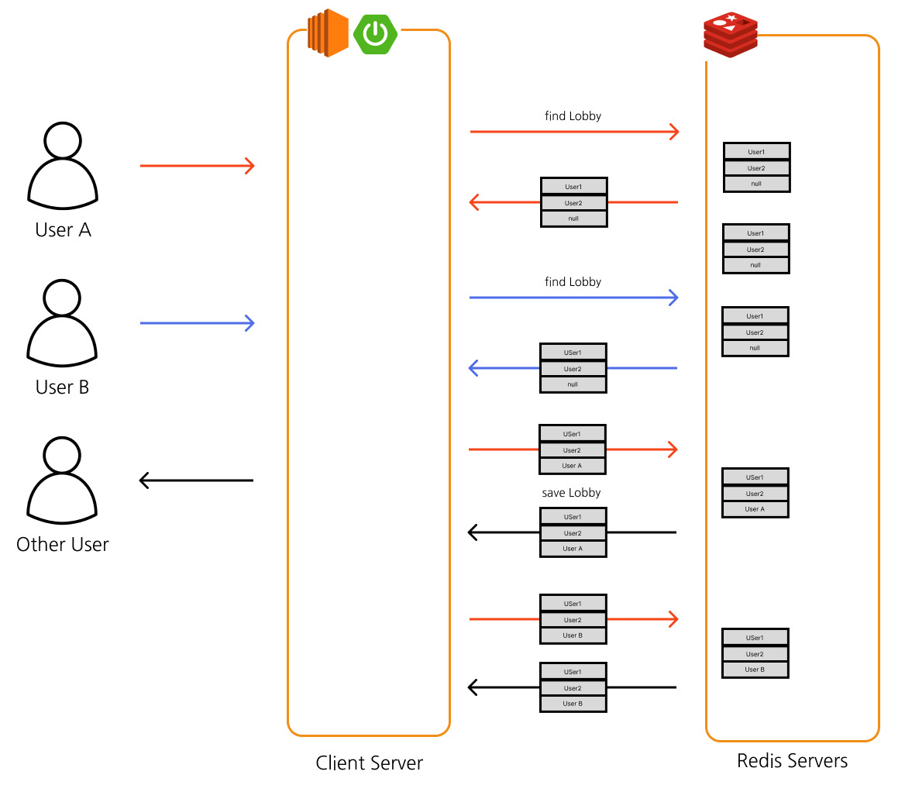

# 동시성 구현 상황 만들기
이전 [Redis Lock 구현하기](../spring-reddison-lock-with-aop)를 만들고 나니 테스트를 짜게 되었다.



이러한 상황을 만들기 위해서는 User A가 요청을 보내어 다시 조회 이후 업데이트하기 전에 User B의 조회가 일어나야한다.
이러한 상황을 강제로 만들어야 한다고 생각했다.

# 동시성 테스트
Spring에서 동시성 테스트를 짜는 방법으로는 `ExecutorService`와 `CountDownLatch`가 있다.

## ExecutorService
자바의 비동기 작업을 관리하는 `Future` 인터페이스를 활용한 비동기 관련 서비스이다.

해당 서비스를 통해 각각의 쓰레드에서 비동기적으로 프로그램을 돌릴수 있다.

```java
ExecutorService executorService = Executors.newFixedThreadPool(쓰래드수);
executorService.execute(
	() -> {
		//로직
	} 
)
```

이럴경우 `exeucte()`에서 람다식으로 넣어준 로직이 다른 쓰레드에서 비동기적으로 작동하게 된다.
이때 execute가 호출될때마다 queue에서 쓰레드를 뽑아 돌리게된다.

## CountDownLatch
멀티 쓰레드 환경에서 작업을 할때 타 쓰레드의 작업이 끝나는 것을 확인하여 sync를 맞추기 위해 사용된다.

```java
int count = 100;
CountDownLatch countDownLatch = new CountDownLatch(count);
for (int i = 0; i < count; i++) {
    executorService.execute(  
            () -> {
                countDownLatch.countDown();  
            }  
    );  
}  
countDownLatch.await();
```
다음과 같이 작업을 한다면 모든 쓰레드에서 countDownLatch.countDown()이 일어날때까지 기다린후 진행하게 된다.
# 테스트 시나리오

1. 2개의 쓰레드를 준비한다
2. 첫번째 쓰레드는 요청도중 강제로 sleep을 시킨다
3. 첫번째 쓰레드가 sleep하는 동안 두번째 쓰레드 요청을 시킨다
4. 두 쓰레드의 요청이 전부 끝난 이후 결과를 비교한다

# 코드

##  RedisLockTestLobbyService

우선 본래 서비스의 메서드로는 요청 도중에 강제로 thread를 sleep 시킬 방법이 없으므로 이를 위한 새로운 서비스를 작성한다
```java
@TestComponent  
class RedisLockTestLobbyService {  
  
    private final LobbyRepository lobbyRepository;  
  
    protected RedisLockTestLobbyService(LobbyRepository lobbyRepository) {  
        this.lobbyRepository = lobbyRepository;  
    }  
  
    @RedisLock(key = "lobby")  
    protected void waitAndInput(@RedisLockTarget String code, String name) throws InterruptedException {  
        Thread.sleep(50);  
        final Lobby lobby = lobbyRepository.findById(code)  
                .orElseThrow(() -> new GameException(ExceptionCode.INVALID_NOT_FOUND_ROOM_CODE));  
        lobby.joinPlayer(name);  
        lobbyRepository.save(lobby);  
    }  
}
```

`@TestComponent`는 test환경에서만 bean에 등록하겠다는 의미이다.

호출 이후에 `Thread.sleep(50)`을 통해 lock을 얻은 이후에 로직이 실행되도록 하였다

```java
@Test  
void 방_한자리_남았을때_동시접근시_최초1인만_입장할_수_있다() throws InterruptedException {  
    // given  
    String expect = "C";  
    Lobby lobby = lobbyRepository.findById(CODE).get();  
    lobby.joinPlayer("A");  
    lobby.joinPlayer("B");  
    lobbyRepository.save(lobby);  
    int count = 2;  
    ExecutorService executorService = Executors.newFixedThreadPool(count);  
    CountDownLatch countDownLatch = new CountDownLatch(count);  
  
    // when  
    executorService.execute(  
            () -> {  
                try {  
                    redisLockTestLobbyService.waitAndInput(CODE, expect);  
                } catch (Exception e) {  
                    e.printStackTrace();  
                } finally {  
                    countDownLatch.countDown();  
                }  
            }  
    );  
  
    Thread.sleep(10);  
  
    for (int i = 1; i < count; i++) {  
        executorService.execute(  
                () -> {  
                    RestAssured.given().log().all()  
                            .contentType(ContentType.JSON)  
                            .when().get("/lobbies?code=" + CODE + "&name=power")  
                            .then().log().all();  
                    countDownLatch.countDown();  
                }  
        );  
    }  
    countDownLatch.await();  
  
    final Lobby actual = lobbyRepository.findById(CODE).get();  
    Assertions.assertThat(actual.isParticipantExist(expect)).isTrue();  
}
```

전체 테스트 코드이다.
중간 Thread.sleep(10)을 통해 Lock을 얻을때까지의 시간을 벌어두었다.
