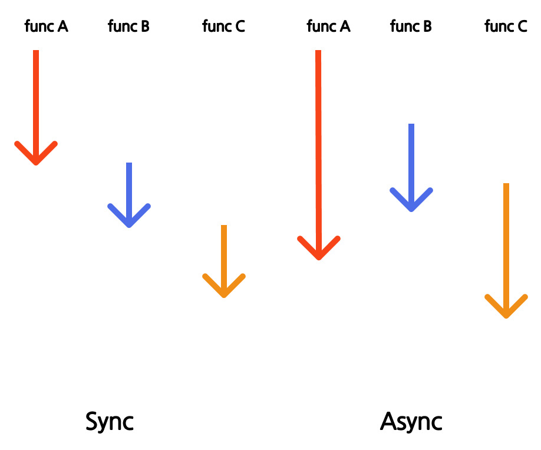

# 그게먼데....
개발공부하다가 항상 Block, Non-Block Sync Async 이 개념에 가장 헤깔리는 개념같다

읽어도 뭔지 몰겠음

걍 똑같은거 같음.... 하면 하수겠지

그래서 이참에 정리하고 가고자 한다.
# Block, Non-Block, Sync, Async에 대해서 아시나요?

# Block, Non-Block

Block과 Non-Block의 차이는 A함수가 B함수를 호출 후 B함수 작업 중 A함수의 작업여부라고 말하면된다.

## Sync, Asyns

동기 비동기의 차이는 요청한 작업의 완료 여부에 따라 순차적으로 일을 실행한다 이다.
즉 동기는 순서가 보장되는 것이고, 비동기는 이 순서를 보장하지 않는다는 것이다.

# Sync == Block ?????
저 말만 잘 들으면 결국 하나 실행될때 다른게 실행 안된다는 뜻이야? 같은 말이자나 할 수도 있다.

나는 서로 다른 관점에서 봐야한다는 생각이 들었다.
Block의 경우 행위를 막는것에 초점으로 두어야하고
Sync의 경우 순서에 초점을 두어야한다.

이것에 관해서는 제어권이라는 것을 봐야한다.
제어권이란 자신을 실행할 권리라고 생각하면 된다.
Block을 좀더 자세히 보자

## Block의 제어권

Block의 경우 제어권이 완전히 호출한 func B로 넘어가면서 본래 함수 (caller)가 호출한 함수 (callee)의 작업 완료되어 return하여 제어권을 넘길때까지 작업을 못하게 된다.

반면 Non Block의 경우 제어권이 계속 func A에 있어 funcB의 반환과 상관없이 작업을 하게 된다. 즉 제어권의 유무가 Block과 Non-Block의 차이인것이다.

## Sync Async의 순서
그럼 Sync와 Async는 어디에 초점을 맞춰야할까

Sync와 Async는 순서에 초점을 두어야한다

이 그림을 보면 A, B, C순서로 함수가 호출된다.

Sync에서는 한 함수가 마무리되야 다음 함수가 호출되게 된다.
하지만 Async에서는 선행된 함수의 반환과 상관없이 다른 함수를 실행할 수 있다.

즉 실행된 함수의 반환 순서를 보장할 수 없는 것이다.

이 그림은 요청이 동시에 들어왔다는 가정이다.

Sync의 경우 걸리는 시간이 총 A, B, C의 함수실행 시간이지만
Async의 경우 가장긴 A의 시간이 된다 (context change의 리소스는 없다고 가정할때)

더 나아가 호출에도 상관이 있다

어떤 main(system이든, 함수든, cpu든 뭐든)에서 각 A, B, C를 호출하였을때
Sync의 경우 결과값 return을 기다린다
하지만 Async의 경우 callback함수를 통해 해당 함수의 결과를 반환받을 수 있다
(아직 이부분이 정확하지 않다. callback에 대해서 좀더 볼 필요가 있다)
# Bloc/Non-Bloc + Sync/Async
이제 서로 다른걸 알았으니 각 조합을 살펴보면 총 4가지가 나온다 (2x2)

여기서 중요한것은 callback이다.
Non-Block + Sync의 경우 callee 실행한 함수의 결과에 caller가 관심이 없다
Non-Block + Async의 경우 실행한 함수의 반환값을 caller가 callee의 결과에 관심이 있다.

# 출처
[동기 비동기 블로그1](https://jh-7.tistory.com/25)
[동기 비동기 블로그2](https://0soo.tistory.com/m/216)
[동기 비동기 블로그3](https://lovethefeel.tistory.com/126)
[동기 비동기 블로그4](https://inpa.tistory.com/entry/%F0%9F%91%A9%E2%80%8D%F0%9F%92%BB-%EB%8F%99%EA%B8%B0%EB%B9%84%EB%8F%99%EA%B8%B0-%EB%B8%94%EB%A1%9C%ED%82%B9%EB%85%BC%EB%B8%94%EB%A1%9C%ED%82%B9-%EA%B0%9C%EB%85%90-%EC%A0%95%EB%A6%AC)
