# 서론

여러 프로젝트를 하면서 의존성을 분리하려고 여러가지 패턴, 스택을 사용해왔다.

특히 이번 Mafia Together에서 SSE를 적용하면서 SSE를 관리하는 로직들이 Game에 있게 되면서 타 어그리게이트에서 SSE 통신하기 위해서는 Game에 의존을 하게 되었다.

이러한 상황에서 Game은 거의 모든 클래스에 의존성을 가지고 있어 순환 참조가 될 것으로 예상이 되었다.

그래서 우리는 이 SSE 를 분리할 필요가 생겼다.

그동안 사용한 의존성 분리에는 DIP, Event, AOP가 있었는데

이번 기회에 어떤 상황에 어떤 방법을 사용할지 생각해보면 좋을 것 같아 적게되었다.

# 의존성이란
의존성이란 의존하는 대상의 변화가 본인에게 영향을 줄 가능성이 있는 경우를 말한다.

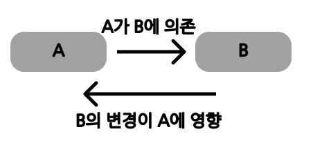

예를 들어 A와 B가 다음과 같이 정의될때
```java
public class A {  
  
    private B b;  
  
    public void func(){  
        b.value += 1;  
    }  
}

public class B {  
    protected int value;  
}
```
A는 B에 의존한다고 표현한다.

이때 변경이 영향이 가는것은

만약 A의 필드 명을 `b -> c`로 바꾸고 B의 필드명을 `value -> val`로 바꿀 경우
```java
public class A {  
	
    private B c;  // b -> c
  
    public void func(){  
        c.val += 1; 
    }  
}

public class B {  
    protected int val; // value -> val  
}
```
A의 변경이 B에는 영향이 없지만 B의 변경은 A에 영향이 생기게된다.

## 클래스 간의 의존성의 종류
### 연관관계
```java
public class A {  
    private B b;  
}
```
### 의존관계
```java
public class A {  
    public B func(B b){  
        return new B();  
    }  
}
```
### 상속관계
```java
public class A extends B{  
}
```
### 실체화 관계
```java
public class A implements B{  
}
```
## 패키지간의 의존성
마찬가지로 어떤 패키지 내의 변화가 다른 패키지에 영향을 끼칠 가능성이 있다면 의존성이 있다고 한다.

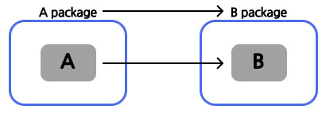

패키지 내에 어떤 클래스가 다른 클래스에 의존하고 있을때 발생한다.

대표적으로 자바에서 확인하는 방법은

```java
package A;

import b.B;

// 생략
```
import에 다른 패키지가 존재할 경우 의존성을 가진다고 볼 수 있다.

또한 intellij에서 확인할 수 있는 좋은 도구가 있다.

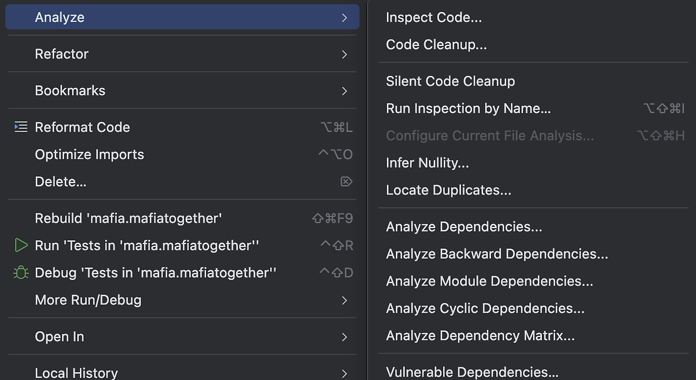

Analyze > Analyze Dependency Matrix 를 통해 패키지의 의존성을 확인 할 수 있는데

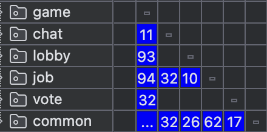

다음과 같이 매트릭스로 한눈에 확인할 수 있다.
# 의존성은 왜 중요한가

## 의존성 지옥

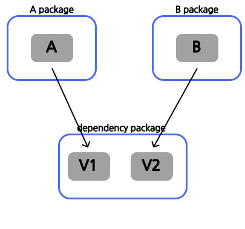

여러 패키지가 동일한 라이브러리 혹은 패키지에 의존성을 가지고 있을때 얘기이다. 이때 각 의존성을 지니고 있는 패키지 혹은 라이브러리가 각각 다른 버전에 의존을 할때 두 버전차이로 문제가 발 생 할 수 있다.

## 결합도

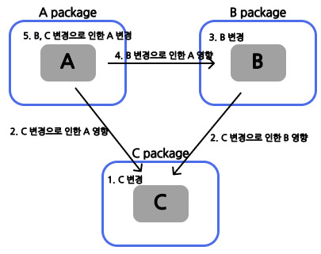

서로간의 의존성이 강해질 수 록 객체 혹은 패키지, 라이브러리 간의 결합도가 높아진다.
이럴경우 한 패키지의 변경으로 인한 영향이 광범위하게 끼쳐서 전체적인 변경 및 수정이 필요하게 된다.
그럴 경우 유지 보수성이 매우 떨어지는 코드가 될 것이다.

## 테스트

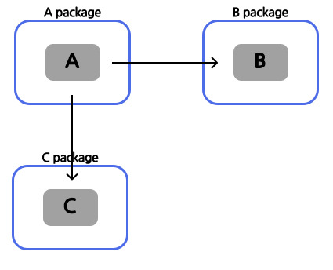

의존성이 강할 경우 테스트할때에도 문제가 발생한다.

A에 대한 단위 테스트를 진행할 시 A를 위한 B, C가 필요하며, B, C에 문제가 생길 경우 A에도 문제가 발생하게 된다.

이러한 부분은 모킹과 같은 방법으로 해결할 수 있겠지만 의존성을 제거할 수 있다면 피할 수 있는 부분일 것이다.

# 의존성 관리 법칙
다음은 우아한 객체지향이라는 영상에서 설명한 의존성 관리 법칙이다.

## 양방향 의존성

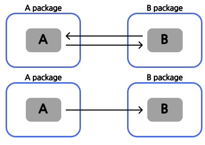

양방향 의존성이 발생할 경우 많은 문제가 야기될 수 있다.
1. 성능이슈
2. 유지 보수성
3. 싱크를 맞춰야함

## 일대다 의존성 (다중성이 낮음)

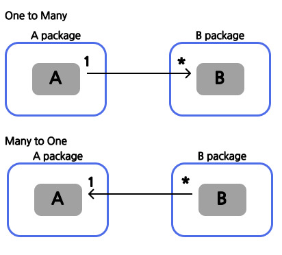

예를 들어
```java
// one to many
public class A{  
    private Collection<B> bs;  
}
```
JPA 의 경우 성능 이슈나 버그등 해당 컬렉션을 관리하기 위한 리소스가 많이 든다.

```java
// many to one
public class B{  
    private A a;  
}
```

## 패키지 사이의 순환 참조는 제거해야한다

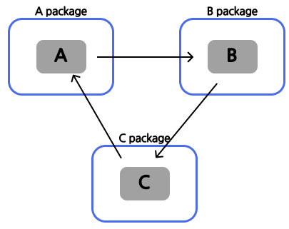

만약 끊어낼 수 없다면 그것은 같은 패키지라고 봐야한다.

# 의존성 때어내기
의존성을 때어내기 위해 여태까지
DIP, Event, AOP를 활용한 경험들이 있다.

## DIP (의존성 역전의 법칙)

의존성 역전의 법칙은 상위 수준의 모듈이 하위 수준의 모듈에 있어서는 안되며 둘 모두 추상화된 인터페이스에 의존해야한다는 SOLID원칙 중 하나이다.
### 양방향 의존일 때

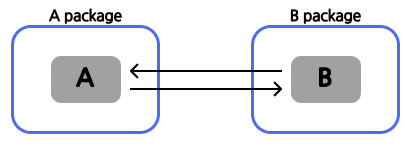


```java
package org.example.dependencystudy.a;  
  
import org.example.dependencystudy.b.B;  
  
public class A  {  
    private B b;  
    private final String val = "A";  
  
    public void setB(B b) {  
        this.b = b;  
    }  
  
    public String getVal(){  
        return this.val;  
    }  
  
    public String getBval(){  
        return this.b.getVal();  
    }  
}
```

``` java
package org.example.dependencystudy.b;  
  
import org.example.dependencystudy.a.A;  
  
public class B {  
    private A a;  
    private final String val = "B";  
  
    public B(A a) {  
        this.a = a;  
    }  
  
    public String getVal(){  
        return this.val;  
    }  
  
    public String getAval(){  
        return this.a.getVal();  
    }  
}
```


```java
@Test  
void dipTest(){  
    A a = new A();  
    B b = new B(a);  
    a.setB(b);  
  
    Assertions.assertThat(a.getBval()).isEqualTo("B");  
    Assertions.assertThat(b.getAval()).isEqualTo("A");  
}
```

위 상황에서 A가 B를 의존해야하는 상황일때
### DIP를 통한 의존성 제거

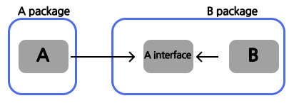

다음과 같이 정의하여 A패키지의 의존성을 제거할 수 있다.
```java
package org.example.dependencystudy.b;

public interface AInterface {  
    String getVal();  
    String getBval();  
}
```
```java
package org.example.dependencystudy.b;  
  
public class B {  
    private AInterface a;  
    private final String val = "B";  
  
    public B(AInterface a) {  
        this.a = a;  
    }  
  
    public String getVal(){  
        return this.val;  
    }  
  
    public String getAval(){  
        return this.a.getVal();  
    }  
}

```


이때 A클라스를 B패키지에서 정의한 인터페이스로 구현한다면

```java
package org.example.dependencystudy.a;  
  
import org.example.dependencystudy.b.AInterface;  
import org.example.dependencystudy.b.B;  
  
public class A implements AInterface {  
    private B b;  
    private final String val = "A";  
  
    public void setB(B b) {  
        this.b = b;  
    }  
  
    public String getVal(){  
        return this.val;  
    }  
  
    public String getBval(){  
        return this.b.getVal();  
    }  
}
```
단순하게 A클래스만 B클래스를 의존시키며 구현할 수 있게 된다.


[dip 구현 코드](https://github.com/waterricecake/dependency-study/tree/dip)

## Event와 AOP의 경우 조금 다른 환경에서 진행하겠다

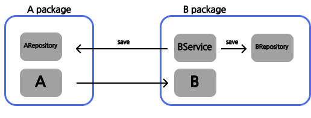

다음과 같이 A entity는 B를 참조하고 있고 (이것을 못바꾼다고 가정)

```java
import jakarta.persistence.*;  
import lombok.Getter;  
import lombok.NoArgsConstructor;  
import lombok.Setter;  
import org.example.dependencystudy.b.B;

@Entity  
@NoArgsConstructor  
@Setter  
@Getter  
public class A  {  
    @Id  
    @GeneratedValue(strategy = GenerationType.IDENTITY)  
    private long id;  
  
    @ManyToOne  
    @JoinColumn(name = "b_id")  
    private B b;  
  
    private String val;  
  
    public void setBval(String val){  
        this.b.setVal(val);  
    }  
}
```

Bservice가 A의 상태를 변환시키고 저장하는 로직이 있다고 하자

```java
package org.example.dependencystudy.b;  
  
import lombok.RequiredArgsConstructor;  
import org.example.dependencystudy.a.A;  
import org.example.dependencystudy.a.ARepository;  
import org.springframework.stereotype.Service;

@Service  
@RequiredArgsConstructor  
public class BService {  
  
    private final ARepository aRepository;  
    private final BRepository bRepository;  
  
    public void changeVal(Long id, String val){  
        A a = aRepository.findById(id).get();  
        a.setVal(val);  
        B b = bRepository.findById(id).get();  
        b.setVal(val);  
        aRepository.save(a);  
        bRepository.save(b);  
    }  
}
```

service에서 A의 상태를 변화시켜야함으로 다음과 같이 양방향 참조가 일어나게 된다.


# Event

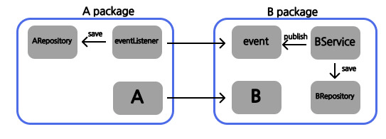

Event는 Spring의 EventListener를 활용하여 의존성을 끊는 방법이다.
EventListener의 원리나 기타 내용들은 다음으로 미루겠다.

요약하자면 정의한 event가 발행했을때 해당 이벤트에 대하여 이벤트 리스너에 등록한 메서드를 실행시키는 방법이다.
```java
package org.example.dependencystudy.b;  
  
import lombok.AllArgsConstructor;  
import lombok.Getter;  
  
@Getter  
@AllArgsConstructor  
public class Bevent {  
    private Long id;  
    private String val;  
}
```
B패키지에 정의한 Event를 해당 메서드가 실행될때 발행한다

```java
package org.example.dependencystudy.b;  
  
import lombok.RequiredArgsConstructor;  
import org.springframework.context.ApplicationEventPublisher;  
import org.springframework.stereotype.Service;  
  
@Service  
@RequiredArgsConstructor  
public class BService {  
  
    private final BRepository bRepository;  
    private final ApplicationEventPublisher applicationEventPublisher;  
  
    public void changeVal(Long id, String val){  
        B b = bRepository.findById(id).get();  
        b.setVal(val);  
        bRepository.save(b);  
        applicationEventPublisher.publishEvent(new Bevent(b.getId(), val));  
    }  
}
```

그 이후 해당 이벤트를 A패키지에서 듣게 한다
```java
package org.example.dependencystudy.a;  
  
import lombok.RequiredArgsConstructor;  
import org.example.dependencystudy.b.Bevent;  
import org.springframework.context.event.EventListener;  
import org.springframework.stereotype.Component;  
  
@Component  
@RequiredArgsConstructor  
public class AEventListener {  
  
    private final ARepository aRepository;  
  
    @EventListener  
    public void listenBevent(Bevent bevent) {  
        A a = aRepository.findById(bevent.getId()).get();  
        a.setVal(bevent.getVal());  
        aRepository.save(a);  
    }  
}
```


[event 구현 코드](https://github.com/waterricecake/dependency-study/tree/event)

# AOP

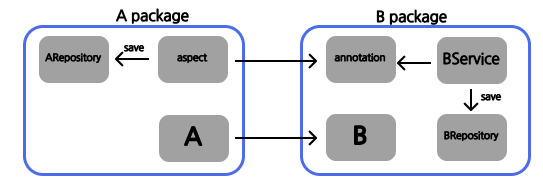

AOP는 횡단 관심사 분리이다.

정확한 목적은 위처럼 의존성을 끊기위함이 아니라

자주 쓰이는 로직을 분리하여 해당 로직을 따로 처리하는 방식이다.

Spring에서는 AOP를 annotation 기반으로 하여 구현하였다.

이를 통해서 특정 패키지의 로직을 다른 패키지에서 처리할 수 있게 한다.

```java
package org.example.dependencystudy.b;  
  
import java.lang.annotation.ElementType;  
import java.lang.annotation.Retention;  
import java.lang.annotation.RetentionPolicy;  
import java.lang.annotation.Target;  
  
@Target(ElementType.METHOD)  
@Retention(RetentionPolicy.RUNTIME)  
public @interface AspectAnnotation {  
}
```
해당 어노테이션을 통해 관심 로직을 메서드로 부터 분리할 것이다.

```java
package org.example.dependencystudy.a;  
  
import lombok.RequiredArgsConstructor;  
import org.aspectj.lang.ProceedingJoinPoint;  
import org.aspectj.lang.annotation.Around;  
import org.aspectj.lang.annotation.Aspect;  
import org.springframework.stereotype.Component;  
  
@Aspect  
@Component  
@RequiredArgsConstructor  
public class AAspect {  
  
    private final ARepository aRepository;  
  
    @Around("@annotation(org.example.dependencystudy.b.AspectAnnotation)")  
    public void around(ProceedingJoinPoint joinPoint) throws Throwable {  
        Object[] args = joinPoint.getArgs();  
        Long id = (Long) args[0];  
        String val  = (String) args[1];  
        A a = aRepository.findByBId(id).get();  
        a.setVal(val);  
        aRepository.save(a);  
        joinPoint.proceed();  
    }  
}
```
이와같이 해당 어노테이션이 있을 경우 이 메서드를 실행하도록 설정하였다.

```java
package org.example.dependencystudy.b;  
  
import lombok.RequiredArgsConstructor;  
import org.springframework.stereotype.Service;  
  
@Service  
@RequiredArgsConstructor  
public class BService {  
  
    private final BRepository bRepository;  
  
    @AspectAnnotation  
    public void changeVal(Long id, String val){  
        B b = bRepository.findById(id).get();  
        b.setVal(val);  
        bRepository.save(b);  
    }  
}
```

이와 같이 B 패키지에서는 A의 의존성을 지울 수 있게 된다.


[aop 구현 코드](https://github.com/waterricecake/dependency-study/tree/aop)

물론 여기서는 AOP의 본래 용도로 활용을 못한점이 있다.

AOP의 본래 목적은 특정 관점을 모듈화 하고 분리하여 처리하는 것에 있다.

하지만 위의 경우 가 아닌 A패키지에서 사용하는 자원이 다른 모든 클래스에서 공통적으로 쓰인다고 가정하자

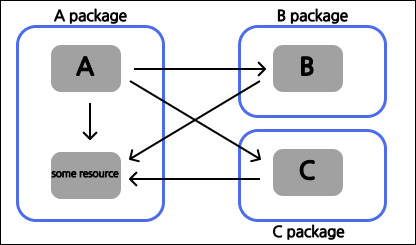

이럴경우 다른 모든 패키지가 A패키지에 의존성을 가지게 된다

하지만 AOP를 통해 해당 리소스를 분리하고 util클래스에서 관리하게 만든다면

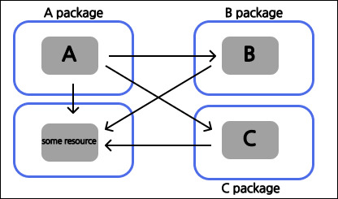

다음과 같이 해당 로직 혹은 리소스만 분리하고 관리할 수 있게 된다
(이럴 경우 각 도메인 패키지간의 의존성은 줄일 수 있게 된다)

## Spring Layered Architect
특히 계층형 구조인 Spring에서는 계층 별 의존성이 중요하다.

계층의 의존성 방향은 항상 상위에서 하위로 가야하기 때문이다.

예를 들어 WebSocket이나 SSE같이 Presentation의 영역의 통신을 Service영역에서 활용을 해야할 경우

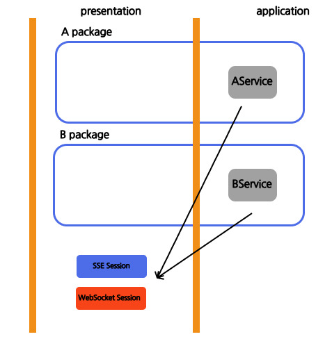

각 서비스에서는 presentation영역의 SSE, WS 세션에서 각 연결을 가져와서 보내줘야한다. 이럴 경우 하위의 계층에서 상위의 계층으로 의존성이 생기게 된다.

하지만 이 로직을 AOP를 통해 분리를 하면

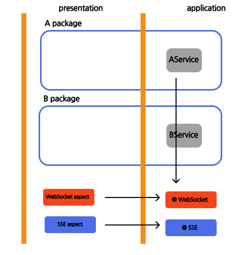

다음과 같이 계층별 의존성을 분리할 수 있게 된다. (물론 AOP가 아니라 DIP로 해결이 가능하다)

# 결론

의존성을 끊는 방법에 대해서 정답은 없고 그냥 상황과 목적에 따라 장단점이 있는 것 같다

|       | 목적          | 구현         | 의존성 분리                               | 대상  |
| ----- | ------------ | ---------- | ------------------------------------ | --- |
| DIP   | 의존성 추상화      | interface  | 구체적인 클래스가 아닌 추상화된 인터페이스를 통한 분리       | 1:1 |
| Event | 비동기, 이벤트 처리 | class      | 모듈간 결합 없이 이벤트 만으로 유연한 확장             | 1:1 |
| AOP   | 횡단 관심사 분리    | annotation | 비지니스 로직에서 공통적인 관심사를 분리<br>계층별 의존성 분리 | 1:n |

DIP : 단순 클래스 끼리의 참조가 있을 경우
Event : 패키지 간의 1대1 양방향 참조가 존재할 경우
AOP : 한 패키지에 있는 특정 로직에 대해서 여러 패키지가 해당 로직을 사용해야 할 경우, 계층에 대한 의존성 분리가 필요한 경우
# 참고
[우아한 객체지향](https://www.youtube.com/watch?v=dJ5C4qRqAgA)
[Dependency hell wiki](https://en.wikipedia.org/wiki/Dependency_hell)

# 예제 코드
[의존성 분리 코드](https://github.com/waterricecake/dependency-study/tree/main)
