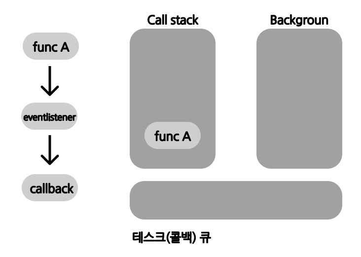

# 서론

요즘 지원을 하다보면 많이 보이는 기술스택은
Node.js랑 Django이다.
Node.js는 프레임워크라기보다는 JVM과 같은 javascript를 돌리기 위한 엔진이라고 생각하면된다.

이번에 Node를 맛보기로 한 이유는 Python은 전에 써봤고 (코테언어로) js를 한번도 안써봐서 궁금해서 써보게 되었다. (맛보기니까)

# Node란?
우선 Node의 언어 Javascript에 대해서 알아보자
javascript는 HTML 에 종속적인 언어로 정적인 html을 동적으로 동작시켜주기 위한 언어이다.

그렇다 보니 이 javascript는 보통 웹 브라우저에서 돌아가는 언어였다.

즉 브라우저 마다 따로 해석하는 엔진이 있었다.

이러던 와중 구글 행님이 V8엔진을 탑제한 Chrome을 출시하셨다.

8기통의 엔진은 좋은 효율을 보였고 구글햄은 이걸 브라우저에 국한되어 있지 않은 Javascript runtime 환경 (실행환경)을 만들어 보기로 했다.

그래서 출시한 것이 Node.js이다

# Node의 특징
## Javascript runtime

>Node.js는 chrome V8 Javascript 엔진으로 빌드된 자바스크립트 런타임입니다

- V8 : 구글 Chrome의 오픈 소스 자바스크립트 엔진
- libuv : 비동기 I/O, C ++, C 로 동작, 이벤트 기반 및 논블로킹 I/O 작업 담당

## Event driven
이벤트가 발생하였을때 미리 지정해둔 작업을 수행하는 방식
이벤트 노드의 이벤트 리스너가 이벤트 발생을 대기하다가 이벤트 발생시 이벤트 리스너에 등록해둔 콜백함수를 호출한다
이때 이벤트가 콜백함수를 처리하는 방법을 살펴보자

다음은
1. func A가 실행
2. func A가 event를 발생시키며 eventlisner를 호출
3. eventlistener가 callback함수를 호출

이라는 시나리오를 살펴보자

func A가 eventlistener를 호출하면 eventlistener는 백그라운드에서 역할 실행하게 된다.

eventlistener가 완료되면서 callback함수를 테스크(콜백) 큐에 넣는다

call stack 의 실행이 끝날때까지 큐는 대기한다

이벤트 루프가 call stack에 callback 함수를 올림

## Non-blocking I/O

논블로킹은 이전 글에서 정리한게 있으니 참고

[Blocking/Non-Blocking vs Sync/Async](../block-sync)

## 싱글 스레드

스레드에 대한 설명은 이전 블로그 참고

[[면접복기] 쓰레드와 프로세스의 차이는 무엇인가요?](../thread-process)

# 서버로서의 노드

위의 설명은 Node 자체의 설명이고 이제 서버로서 노드는 어떤 장단점을 가지고 있는지 알아보자

## Node의 단점

Node는 libuv라이브러리를 통해 싱글 스레드, I/O 작업을 수행한다.

이때 스레드 하나가 많은 수의 I/O 작업을 담당하게 된다.

이때 CPU 부하가 큰 작업이 들어오게 된다면 하나의 스레드가 감당해야하기 때문에 적합하지 않게 된다.

물론 Node 12 에서 멀티 스레드 기능을 안정화 하면서 제공을 해주지만 다른 언어들 (C, C++, Rust, GO)와 같은 언어에 비해 속도가 떨어진다.

즉 이미지 비디오와 같은 미디어 처리, 대규모 데이터 처리와 같은 작업에는 어울리지 않다.

## Node의 장점

Node는 CPU의 부하가 적은 개수는 많지만 (Queue에 저장하면 되니) 각각의 크기가 작은 데이터를 실시간으로 주고 받는데는 적합하다. 예를 들어, 실시간 채팅이나 주식 차트, JSON 데이터를 제공하는 API 서버에 어울린다.

## 단점이 큰것 같은데

앞에서 말했듯이 Node는 여러 회사에서 선택한 서버 (백엔드) 스택이다.

특히 스타트업이나 초기 프로젝트에서 많이 쓰인다.

그이유는 바로 Node의 생산성에 있다.

우선 Node는 웹 서버가 내장되어 있다. 때문에 다른 서버들은 아파치, nginx, 톰캣을 추가로 설치해야하는 경우가 있다. 이러한 부분에서 따로 다른 웹 서버에 대한 요구사항이 떨어지기 때문에 생산성이 높다 (물론 추후 서버가 커지던가 (scale out) 하면 nginx같은 별도의 웹 서버를 연결해야한다)

또한 Node는 브라우저에서 사용하는 javascript를 사용하기 때문에 하나의 언어로 웹사이트를 개발할 수 있다는 장점이 있다. 이는 획기적으로 개발 생산성을 높이고, 여러 기업에서 채택하는 이유가 되었다.

# 출처
Node.js 교과서 개정 3판, 조현영 지음, 길벗출판사
