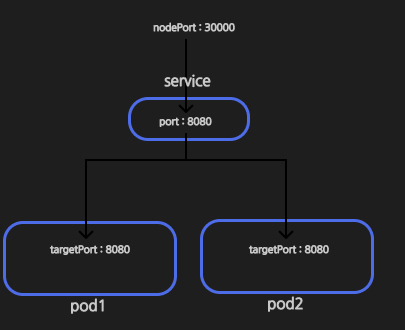

# 디플로이먼트

이에 대한 설명은 [쿠버네티스, 맛보기](../kube-pod)에 정리해 놓았다.

## 장점
- 파드의 수를 지정하는 대로 여러 개의 파드를 쉽게 생성할 수 있다
- 비정상적으로 종료된 경우, 알아서 새로 파드를 생성해 파드 수를 유지한다
- 동일한 구성의 여러 파드를 일괄적으로 일시 중지, 삭제, 업데이트를 하기 쉽다
 
## 디플로이먼트 매니페스트

```yaml
apiVersion: apps/v1
kind: Deployment

metadata:
  name: spring-deployment

spec:
  replicas: 3
  selector:
    matchLabels:
      app: backend-app

  template:
    metadata:
      labels:
        app: backend-app
    spec:
      containers:
        - name: spring-container
          image: spring-server
          imagePullPolicy: IfNotPresent
          ports:
            - containerPort: 8080
```

여기서 `spec.selector.matchLabels`와 `spec.template.labels`와의 관계를 잘 알아야 한다

`spec`은 이 디플로이먼트의 스펙을 정의하는 것이며

`spec.template`은 이 디플로먼트를 통해 생성할 레플리카셋의 파드를 정의하는 것이다.

이때 `matcheLabels`를 통해 `spec.template.labels`와 동일한 라벨을 가져와 그 갯수만큼 생성하는 것이다.

# 서비스

이에 대한 설명은 [쿠버네티스, 맛보기](../kube-pod)에 정리해 놓았다.

실제 서비스에서 파드에 요청을 보낼때 포트포워딩이나 파드 내로 직접 접근하지 않는다. 서비스를 통해 요청을 보내는 것이 일반적이다.

## 서비스 종류

### `NodePort`
외부에서 접속 가능하도록 하는 서비스, 쿠버내티스 내부에 접속하기 위한 포트를 열도록 사용

### `ClusterIP`
외부에서는 요청할 수 없는 서비스, 쿠버내티스 내부에서만 통신을 하는 IP를 부여한다

### `LoadBalancer`
외부의 로드밸런서( ex: ELB)를 활용해 외부에서 접속할 수 있도록 연결한다.

## 서비스 매니페스트
```yaml
apiVersion: v1
kind: Service

metadata:
  name: spring-service

spec:
  type: NodePort
  selector:
    app: backend-app
  ports:
    - protocol: TCP
      port: 8080
      targetPort: 8080
      nodePort: 30000
```

 - `spec.type` :  서비스의 종류를 결정짓는 항목이다
 - `spec.selector` : 서비스가 담당할 파드 명
 - `spec.ports` : 포워딩을 해줄 포트의 정보
 - `spec.ports.port` :  서비스의 내부 포드
 - `spec.ports.targetPort` :  타겟 파드의 내부 포트
 - `spect.ports.nodePort` :  서비스에 접근할 포트

정리하자면


nodePort로 오면 service내에 8080으로 포워딩 해주고 해당 요청을 이제 각 pod의 targetPort로 포워딩 해주는 방식이다

# Deployment 수정

디플로이먼트를 수정하여 파드의 갯수를 수정해보자

디플로이먼트는 레플리카셋을 생성하는 역할도 하지만 더 나아가 변형을 감지하고 업데이트하는 역할도 한다

만약 기존 `spec.replicas`를 3 -> 5로 수정한 후

```yaml
spec:
  replicas: 5 # 3
  selector:
    matchLabels:
      app: backend-app
```

적용을 하면 (생성때와 같은 명령어)
```bash
> kubectl apply -f spring-deployment.yaml
## deployment.apps/spring-deployment created (생성시)
deployment.apps/spring-deployment configured
```

다음과 같은 출력을 확인 할 수 있다.

그 후 pod를 확인해보면 증가한 것을 알 수 있다.

```bash
kubectl get pods
NAME                                 READY   STATUS    RESTARTS   AGE
spring-deployment-7565bdff49-2slxj   1/1     Running   0          45m
spring-deployment-7565bdff49-ktbvz   1/1     Running   0          10s
spring-deployment-7565bdff49-q2pvk   1/1     Running   0          10s
spring-deployment-7565bdff49-r7w5q   1/1     Running   0          45m
spring-deployment-7565bdff49-tdj2f   1/1     Running   0          45m
```

AGE가 10초인 파드를 통해 새로 생성된 것을 확인 할 수 있다.

# Self-Healing

Pod가 사망시 자동으로 복구하는 기능

이를 확인하기 위해 `docker` 자체를 제거하여 파드가 어떻게 되는지 확인해 본다

```bash
docker ps # 만약 permission denied가 뜨면 걍 sudo로 진행
```

이후 실행되고 있는 컨테이너 하나를 강제로 제거한다

```bash
docker kill {컨테이너 id} # docker rm -f {컨테이너 id} 도 됨
```

이 후 파드를 확인해 보면

```bash
kubectl get pods
NAME                                 READY   STATUS    RESTARTS   AGE
spring-deployment-7565bdff49-2slxj   1/1     Running   0          69m
spring-deployment-7565bdff49-ktbvz   1/1     Running   0          24m
spring-deployment-7565bdff49-q2pvk   1/1     Running   1          24m
spring-deployment-7565bdff49-r7w5q   1/1     Running   0          69m
spring-deployment-7565bdff49-tdj2f   1/1     Running   0          69m
```

5개 그대로인 것과 함께 `RESTARTS`가 증가한 파드 하나를 통해 재시작 되며 `Self-Healing`을 확인할 수 있다.

# 새로운 버전의 서버로 업데이트

기존 spring 서버가 업데이트 되어 새로운 jar가 빌드되었다고 가정하자

```bash
./gradlew clean build
docker build -t spring-server:1.0 .
```

이렇게 해서 새로운 이미지가 빌드 되었을때 이 버전으로 배포해보자

```yaml
# 생략

spec:
# 생략
    spec:
      containers:
        - name: spring-container
          image: spring-server:1.0 # 이미지 버전 명시
          imagePullPolicy: IfNotPresent
          ports:
            - containerPort: 8080
```

다음과 같이 디플로이먼트 매니패스트에 이미지 버전을 명시 후

```bash
kubectl apply -f spring-deployment.yaml
deployment.apps/spring-deployment configured
```

변경이 되었다는 명령어와 함께

```bash
kubectl get pods
NAME                                 READY   STATUS        RESTARTS   AGE
spring-deployment-6c674c6cb6-4q9sh   1/1     Running       0          4s
spring-deployment-6c674c6cb6-58v7s   1/1     Running       0          4s
spring-deployment-6c674c6cb6-dk89v   1/1     Running       0          2s
spring-deployment-6c674c6cb6-n8tj2   1/1     Running       0          2s
spring-deployment-6c674c6cb6-wqmn4   1/1     Running       0          4s
spring-deployment-7565bdff49-2slxj   0/1     Terminating   0          78m
```

오래된 것은 삭제하며 새 버전의 파드를 배포하는 것을 확인할 수 있다.

# 출처
[비전공자도 이해할 수 있는 쿠버네티스 입문/실전](https://www.inflearn.com/courses/lecture?courseId=335433&unitId=252414&tab=curriculum&subtitleLanguage=ko)
