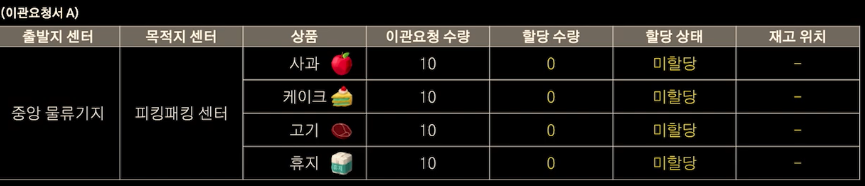
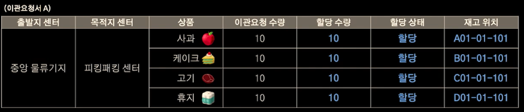
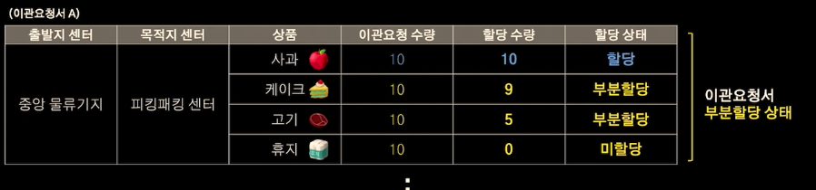
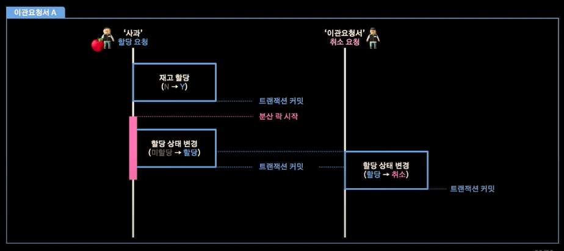
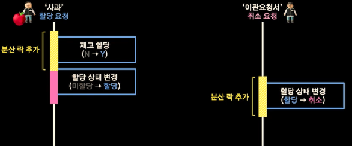
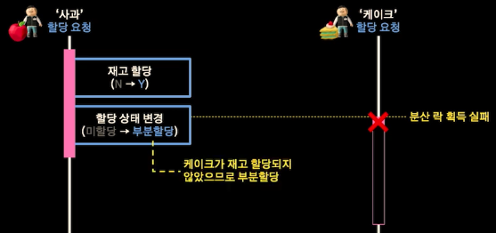
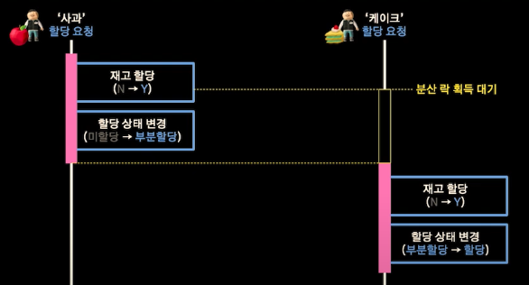
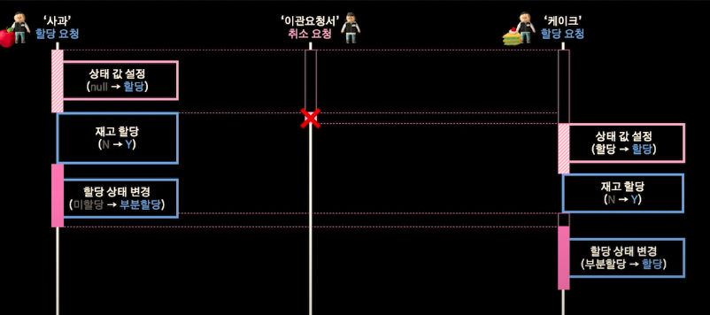

# 서론
[WMS 재고 이관을 위한 분산락 사용기](https://www.youtube.com/watch?v=3HCVD26zycM)라는 우아콘 발표 자료

# 도메인 설명

## WMS란?
Warehouse Mangement Systme, 창고 관리 시스템
- 상품 입고 및 검수/ 검품
- 실시간 재고 정보 관리 및 실사
- 고객 주문에 따른 상품 출고

## 물류 센터


여기서 피킹패킹이란, 상품을 가져오는 것과(피킹) 포장하는 것(패킹)을 하는 센터를 의미

## 이관 요청

### 이관요청서
물류센터에서 피킹패킹 센터로 이관 요청시 하나의 요청서에는 수백개에서 수천개의 항목에 대한 요청서를 작성

이때 각 항목별로 이동할 특정 위치의 특정 제품을 선점하는 것을 할당한다라고 정의





작업자는 이 재고 위치를 통해 실제로 제품을 이관하게 됨

수량 만큼 할당이 되지 않을 경우 부분할당으로 명명



- 할당
  이관하기 위해 특정 위치의 재고를 선점하는 작업
- 취소
  미할당 상태의 이관요청서를 취소하는 작업
  

# 할당과 취소를 동시에 요청한다면?

두 관리자에 의해 한 이관 요청서가 서로 다른 요청이 올 경우

## 동시성 이슈 발생 가능

관리자 A가 할당 요청을 하고 B가 실패요청을 할 경우 해당 제품의 수량이 할당 상태가 되지만 상태는 미할당이 되게 됨

## 동시성 이슈 원인



재고 할당 이후 -> 취소로 덮어씌어짐

### 코드 단위
#### 할당 로직
``` kotlin
fun updateStatus(orderId: Long) {
	redisLock.lock(key = orderId, waitSecond = 5) {
		funtionalTransactional.run {
			val order = orderService.getByOrderId(orderId)
			// 할당 결과에 따라 상태 변경
			order.updateAllocationStatus()
		}
	}
}
```
상태 변경전 분산락을 실행 -> 분산락의 단위가 이관 요청서

#### 취소 로직
제고 확인 없이 바로 실행 -> 별다른 로직없음
``` kotlin
fun updateCancelStatus() {
	if (this.status.isNone()) {
		this.status = CANCEL
	}
}
```
STATUS에 아무 상태가 없을 시에만 취소 -> 분산락 요청 없이 상태 변경 -> 동시성 고려 안함

## 동시성 이슈 원인 결론

할당와 취소가 동시에 되는 케이스 고려되지 않음
  -> 취소 요청에도 분산락 추가

# 해결과정

## 1 단계 : 분산 락 추가하기



다음과 같이 상태 변경 전 락 획득을 시도 하고 취소에도 락 획득을 시도

하지만 이 경우 할당과 취소의 동시성 이슈를 막을 수 있지만 모든 락 획득에 실패



> 분산 락 단위가 이관요청서이므로 상품을 일괄 할당할 수 없음

## 2단계 : 분산 락 대기

락 획득 대기 로직 추가



분산락을 대기하는 만큼 총 대기시간이 증가

> 동일 유형의 요청을 병렬 처리할 수 있도록 상태 키를 추가

## 3단계 : 분산 락과 상태 키를 함께 사용하기

상태 변경시에만 분산락을 설정하고 재고 할당은 분산락 밖에서 



재고에 대한 할당은 병렬적으로 처리 가능, 취소 요청의 경우 상태 값이 중요하므로 락 획득을 실패하면 진행을 못하며 이후에는 상태가 주어 졌으므로 정책상 취소 불가능이 됨

## 코드단위

### 할당 로직
```kotlin
fun tryAllocationStatusLock(orderId: Long) {
	redisLock.lock(key = orderId, waitSecond = 5) {
		val status = getCurrentStatus(orderId)
		when (status) {
			ALLOCATION, NONE -> {
				// 상태 설정 및 유효시간 갱신
				setStatus(ALLOCATION, 30)
			}

			CANCEL -> {
				// 예외 발생
				throw RuntimeException("(할당 -> 취소) 동시성 이슈 발생")
			}
		}
	}
}
```

### 취소 로직
```kotlin
fun tryCancelStatusLock(orderId: Long) {
  redisLock.lock(key = orderId, waitSecond = 5) {
    val status = getCurrentStatus(orderId)
    when (status) {
      ALLOCATION -> {
        // 예외 발생
        throw RuntimeException("(취소 -> 할당) 동시성 이슈 발생")
      }

      CANCEL -> {
        // 상태 설정 및 유효시간 갱신
        setStatus(CANCEL, 30)
      }
    }
  }
}
```

# 고찰

해당 발표를 요약하자면 

> 분산 환경에서 발생 하는 동시성 이슈 해결 방법

이었다.

각 단계별 해결 방법에서 느낀것이 있다

## 1 단계 분산락 추가

모든 로직에 대해서 분산락을 추가하여 경쟁상태를 완화해보는 방법이다.

확실한 방법이기는 하지만 아직 락 획득 실패시 바로 전체 로직 자체를 실패하도록 구현을 해놓은 것 같다.

근데 이 실패를 하지않고 대기를 해도 되는 로직에도 실패가 되어 있는 모양이다.

근데 이 상태라면 해당 동시성 이슈를 마주하기 전에도 같은 이관요청서에 동시 할당 요청이 들어올 경우 하나가 실패하면서 예외처리가 나지 않았을까 라는 생각이 든다.

## 2단계 분산락 대기

이 부분이야 락이나 동시성 환경에서 항상 나오는 주제인것 같다.

최근 본 면접에서도 락을 통해 순서 보장에 대한 질문이 온 적 있었는데 너무 비효율적이지 않겠냐 라는 것이 기억났다.

Lock 자체를 Redis로 요청하는 것 같던데, 분산환경에서 Lock 캐싱으로 사용하기 위해서 사용하고 데이터는 따로 관리하는지 아니면 데이터 자체를 캐싱하기 위해 사용하는지 궁금해졌다.

## 3단계 분산 락과 상태 키를 함께 사용하기

이 해결 방식은 나름 재미있게 봤다.

분산 락 단위가 이관요청서 단위이다 보니 묶여있는 데이터들이 많고 이 때문에 한 이관요청서에 대해서는 병렬적인 업데이트가 불가능하다라고 판단하였다.

그래서 해결 방법으로 해당 이관요청서의 락을 획득 후 상태 검증으로 실행 시키며, 상태 변경에 만 락을 걸고 이후 재고 할당 로직에서는 락없이 진행을 하였다.

동시성 이슈에서는 보통 아키텍쳐 적인 설계나 알고리즘을 통해 해결해 왔는데 이러한 락을 거는 단위나 시점을 통해 해결 한것이 인상깊었다.

하지만 보면서 의문점이 생긴 부분이 있다. 

이렇게 할 경우 재고에 대한 할당 로직이나 상품 자체의 할당 상태 등은 보호를 받지 못하게 될 것이다. 

예를 들어, 2개의 이관요청서에 대한 요청에 1개의 상품이 중복으로 존재하고 두가지 이관요청서의 할당 요청이 동시에 요청될때, 이 상품의 재고 이상으로 할당이 요청되는 이슈가 발생할 거라고 생각이 든다.

이럴 경우, 결국 상품에 대해서도 락을 걸게 되고, 똑같이 일괄적으로 처리가 어려워져 락 획득 대기 시간이 길어지게 될 것이다.

특히나 수백 수천개의 상품이 한 이관요청서에 존재하고 이러한 상품이 서로 엮여있는 상태에서 각 상품의 락을 순차적으로 대기할 경우 한 이관요청 할당 시간이 매우 오래 걸릴 것 같다.

물론 이 이관요청서 자체가 백오피스적인 부분이기 때문에 이관요청에 대한 할당 요청이 동시에 수백 수천개가 요청되는 것이라고 생각되지 않는다.

그래서 고려안한 케이스일지도 모르겠다고 생각이 들지만, 만약 이러한 이관요청이 동시에 수백 수천개가 요청되는 상황이라고 가정한다면 위의 방법으로는 부족할 것 같다는 생각이 들게 되었다.