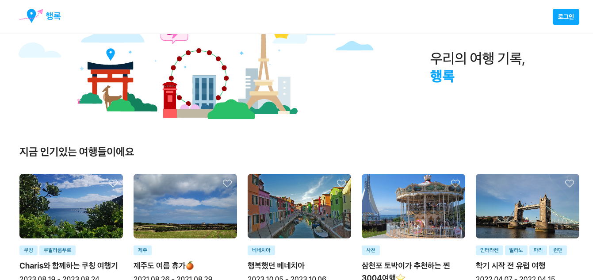

# 현상

행록 사이트 접속이 안됨

페이지가 로드 되는걸 보면 프론트 페이지는 정상 작동되는것을 보임

postman으로 Spring api 요청시 

```json
{

"code": 9999,

"message": "서버 에러가 발생하였습니다. 관리자에게 문의해 주세요."

}
```

를 보이며 원인 확인 불가

# 원인
원인을 찾아보기 위해 Spring 로그를 찍어보니

```bash
org.springframework.data.redis.RedisConnectionFailureException: Unable to connect to Redis
```

로 레디스 서버 문제로 확인

레디스를 확인해보니

```
redis:
  host: {이전 우테코 인스턴스}
```

?????

이전 우테코에서 제공해준 AWS 인스턴스를 사용하고 있었음(이전하면서 바꾸지 않은듯)

보통 우테코 종료시 AWS 인스턴스를 삭제하는 것으로 알고 있는데 놓쳤나봄

그러다 이번 6기 종료하면서 같이 삭제된듯

여튼 해당 yml 수정 후 재배포

하지만 build 과정에서
```bash
java.lang.IllegalStateException at DefaultCacheAwareContextLoaderDelegate.java:143
Caused by: org.yaml.snakeyaml.constructor.DuplicateKeyException at SafeConstructor.java:129
```

yml에 중복키 발생한 것으로 판단 해당 키를 수정하고 배포하여 해결


