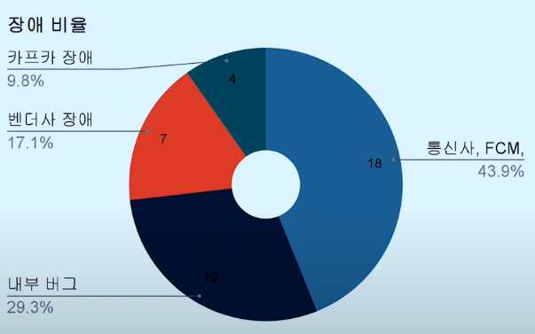
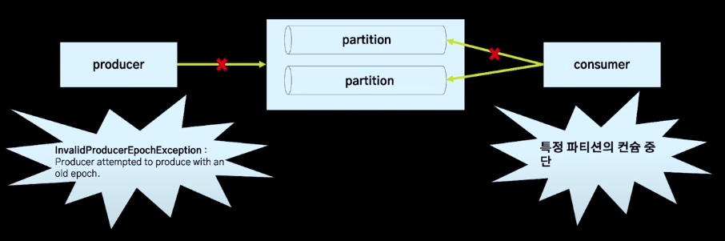
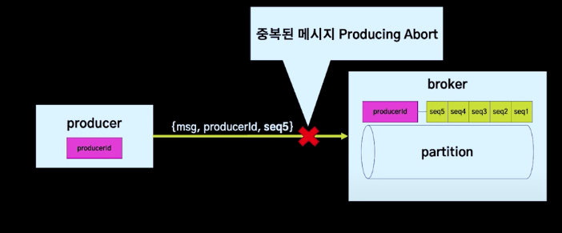
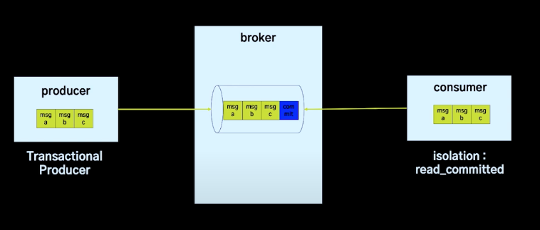
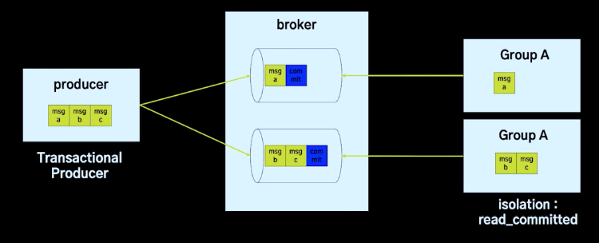
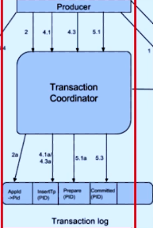
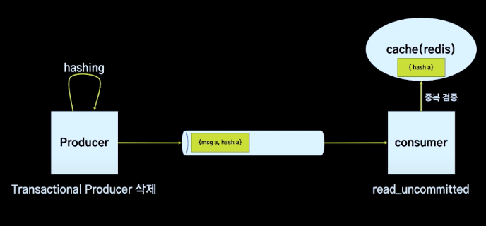
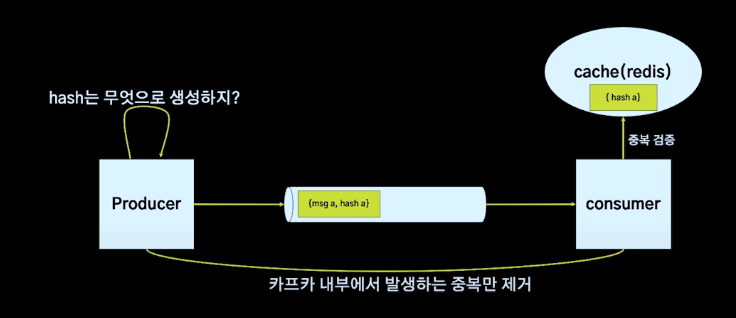
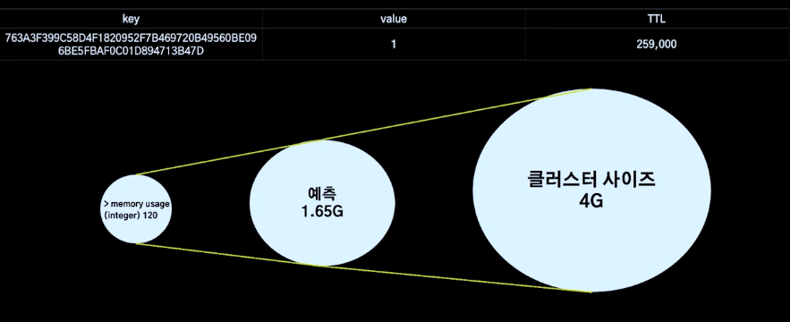

# [Kafka를 이용하는 메시지 플랫폼에서 장애를 겪으며 아키텍쳐를 개선한 이야기](https://www.youtube.com/watch?v=dG2Dr3jhSZg&t=1049s)

## 발표자
- 구도 시스템 개발 팀 서버 개발자 허창오 (카프카 Exactly Once 아키텍쳐 개선)
- 구도 시스템 개발 팀 서버 개발자 김동환 (3배 트래픽 요구사항 해결)

두개를 기준으로 나눠서 포스팅

구도 시스템 개발 팀 : 배달의 민족의 여러 다양한 서비스들의 기반이 되는 플랫폼을 제공

# 내용
## 메시지 플랫폼
고객, 사장, 라이더, 임직원 및 관계사의 여러 메세지에 책임을 가짐

## 메시지 플랫폼의 장애
23 (작년의 장애) + 18 (올해) -> 한달에 1개이상 발생

## 장애 비율

- 통신사, FCM : 외부 서비스의 장애이므로 당사에서 처리 불가능
- 내부 버그 : 복잡도가 높은 메시지 도메인
- 벤더사 장애 : 벤더사에 요청을 하여 발송, 벤더사를 3중화하여 관리 -> 이로 인해 장애가 더 발생
- 카프카 장애 : 메시지 플랫폼은 요청부터 발행까지의 파이프라인을 카프카로 해결

여러 상황들을 모니터링을 하며 관리함

## 아키텍처 개선을 결심하게 된 장애

23년도 10월 1건 11월 2건 발생

각각 메세지 발송 3%, 56%, 10% 발송 실패

대응 시간 총 8시간

## 장애 현상

## Kafka Exactly Once
카프카는 메시지 전달하기 위한 시메틱을 몇가지 가지고 있음

그 중에 `Exactly Once`는 정확히 한번만 메세지를 전달함

### Exactly Once
#### 멱등성 Producer

  

  프로듀서와 파티션 사이의 중복을 막기위한 기능
  
  프로듀서가 보낸 메세지의 `ProducerID`가 `partition`이 가지고 있는 `seq`번호와 맞지 않으면 막으면서 중복을 제거(??? 이건 좀더 알아봐야 할듯)
#### Transaction

프로듀서가 여러 메세지를 한 트랜섹션으로 묶고 싶을때 사용
  
주의 : 프로듀서가 같은 트랜젝션에 여러 토픽의 메세지를 보낼경우 토픽별로 메세지가 각 컨슈머로 나누어 요청되어 다른 쓰레드에서 처리가 됨, 또한 아래 `msg b`, `msg c`의 경우 같은 그룸의 컨슈머에서 처리되어도 한 메시지가 실패하면 다른 메세지는 중복되어 처리될 수 있음 -> 비지니스 로직으로 멱등성을 보장해야함
  
  

트랜젝션을 사용할 경우 `Producer`와 `Transaction Coordinator`(`broker`에 위치)의 핸드 쉐이킹이 일어난다.

1. `Producer`가 처음 트랜섹션 생성을 할때 `Transaction Coordinator`에게 컨텍스트 생성을 요청
2. `Producer`가 각 메세지를 전송할때 어떤 `Partition`에 있을지 `Transaction Coordinator`에게 전달, 이 후 `Transaction Coordinator`는 해당 정보를 관리
3. `Producer`가 트랜섹션이 완료되었다고 알려주면, `Transaction Coordinator`가 `Broker`의 커밋 메세지를 트랜섹션에 포함되는 `Partition`에게 넣어줌

## 왜 Exactly Once를 사용하였는가?

- api 한번의 호출로 최대 100명에게
- 메시지 중복 발신 방지

-> Exactly Once 사용과 직접 구현 간의 비교

| Exactly Once | 직접구현                       |
| ------------ | -------------------------- |
| 적정 수준의 중복 방지 | 보다 완벽한 중복방지                |
| 인프라 비용 감소    | 인프라 비용 증가(Redis와 같은 추가 필요) |
| 아키텍처의 심플함    | 아키텍처 복잡도 증가                |

### Exactly Once의 장점
1. 별도의 Redis와 같은 인프라를 사용 안하여 복잡도 감소
2. 중복에 대한 로직을 카프카가 사용하면서 관심 분리

## 장애 원인 파악

여러 테스트를 통해 추적해보았지만 찾지 못했음 -> 다양한 원인 있을 것으로 추정

->  KIP (카프카 인프리먼프 프로퍼셜) : 논의 프로세서

에서 카프카를 모니터링하고 조치할 수 있는 툴을 제공

## Exactly Once 제거 결정

인프라 비용 감소나 아키텍쳐 심플함 보다 플랫폼 유지 비용이 더 커짐

메시지 플랫폼은 장애가 자주 발생 -> 유지비용 자체를 낮춰야함 (장애가 자주 나므로)

## 중복 제거를 위한 노력

### 중복 제거 
#### 아키텍쳐

producer에서 해쉬를 생성하고 redis에 캐싱하여 커슈머가 해쉬를  통해 중복 확인

#### 정책 고민

처음에는 Producer 쪽에서 수신자와 메시지 내용으로 해쉬 생성으로 고민

하지만 이는 동일한 사용자가 동일한 내용을 2번 보냈을때 막히는 이슈 발생

클라이언트 측이 중복 메시지에 대한 결정을 하는 것으로 고민

하지만 기능이 추가 될따마다 파라미터가 추가되고 메시지 플랫폼의 복잡도가 증가 -> 유저가 사용하기 힘듬

고로 API Request에 대한 해쉬를 생성하기로 함 -> api 요청에 대한 중복을 막을 수 있음

## 캐시 용량 예측

## 롤백

Redis 부하가 심해짐

실제 용량 예측보다 더 많이 사용하게 됨

## 메모리 최대를 사용하면 ?

key eviction 전략 : allkeys-lru

오래전 생선된 키 값을 기준으로 eviction이 일어남

-> eviction으로 인한 부하 증가

key eviction process
Redis는 클라이언트 명령이 실행될때 최대 메모리를 이상으로 메모리를 사용하는지 판단하고 계속해서 삭제함

클러스터를 사용하다 보니 부하가 레플리케이션까지 전파됨 -> 롤백을 하게됨

TTL을 줄여 메세지 갯 수및 클러스터를 늘림

-> 이슈 해결

# 느낀점

