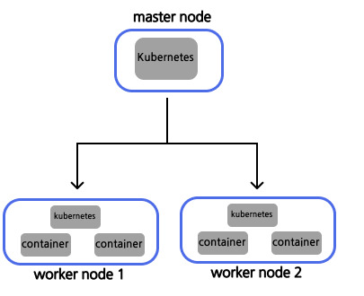
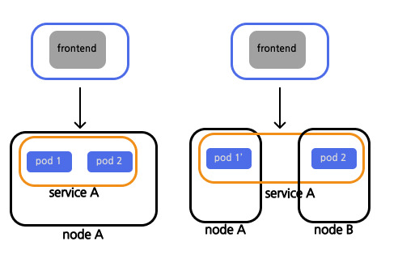
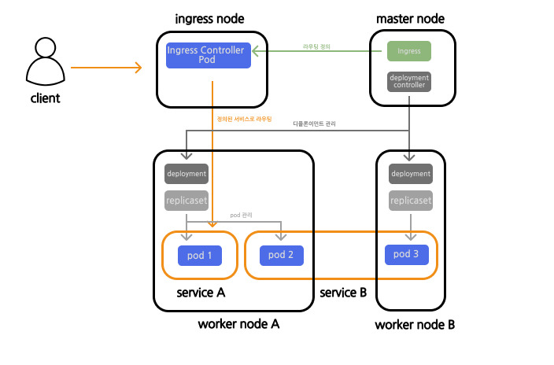

## 1. 쿠버네티스란

쿠버네티스, k8s라고도 불리며 줄여서 kube로 표기하기도 한다.

쿠버네티스는 컨테이너 오케스트레이션의 일종이다.

컨테이너 오케스트레이션이란 시스템 전체를 통괄하고 여러 개의 컨테이너를 관리하는 일을 말한다.

컨테이너화된 어플리케이션의 배포, 관리 및 확장을 예약하고 자동화하기 위한 컨테이너 오케스트레이션 플랫폼이다.

2014년 오픈소스와 되기전 Google 엔지니어들에 의해 처음 개발되었다.

### 1.1. 쿠버네티스 이전 컨테이너 관리
#### 1.1.2. 전통적인 배포 시대

애플리케이션을 한 물리 서버에서 실행하면서 여러 애플리케이션의 리소스 한계를 정의할 방법이 없었기에 리소스 할당의 문제가 발생했다.

특정 애플리케이션들이 리소스를 대부분 차지하게 되면서 다른 애플리케이션의 성능이 저하될 수도 있었다.

이에 대한 해결책으로 여러 물리 서버에 각 애플리케이션을 실행할 수도 있었지만 이는 충분히 리소스가 활용되지 않다는 점에서 확장 가능하지 않았으며 물리 서버를 유지하는데 많은 비용이 들게 된다.

#### 1.1.3. 가상화된 배포 시대
다중 물리 서버에 대해 문제점을 해결하기 위해 가상화가 도입되었다. 

단일 물리 서버의 CPU에서 여러 가상 시스템(VM)을 실행할 수 있게 하는 것이다.

VM간에 애플리케이션을 격리하며 서로간의 정보를 자유롭게 액세스 할 수 없게 하여 일정 수준의 보안성을 제공할 수 있게 한다.

이를 통해 물리 서버의 리소스를 보다 효율적으로 활용하며, 쉽게 애플리케이션을 추가하거나 업데이트하고 하드웨어 비용을 절감하며 더 나은 확장성을 제공할 수 있게 한다.

각 VM은 가상화된 하드웨어 상에서 자체 운영체제를 포함한 모든 구성 요소를 실행하는 하나의 완전한 머신이다.

#### 1.1.3. 컨테이너 개발 시대

컨테이너는 VM과 유사하지만 격리 속성을 완화하여 애플리케이션 간에 운영체제를 공유한다.

VM보다 가벼우며 VM과 마찬가지로 자체 파일 시스템, CPU 점유율, 메모리, 프로세스 공간등을 가진다.

기존 인프라와의 종속성을 끊었기 때문에, 클라우드나 OS 배포본에 모두 이식할 수 있다.

### 1.2. 쿠버네티스

컨테이너는 애플리케이션을 격리시키며 실행하고 관리하기 편한 방법이다.

예를들어 docker 컨테이너의 경우 Dockerfile을 통해 쉽게 이미지를 생성하고 이를 배포환경에서 편하게 받아와서 실행 시킬 수 있다.

또한 docker compose를 통해 여러개의 컨테이너를 쉽게 실행시키고 관리할 수 있다.

하지만 docker 만으로는 해당 컨테이너에 장애가 발생하였을때 추적하고 재시작하거나 관리하기 힘들다.

이러한 컨테이너의 상태를 파악하고 관리하는 총괄 관리하는 소프트웨어가 필요해졌고 이를 해주는  것이 쿠버네티스이다.

공식 사이트에서는 쿠버네티스는 다음 기능을 제공한다고 한다

- 서비스 디스커버리와 로드 밸런싱
	  DNS를 사용하거나 자체 IP주소를 사용하여 컨테이너를 노출할 수 있다. 이에대한 트래픽이 많으면 쿠버네테스는 이를 로드벨런싱하고 배포하여 안정적으로 다루어준다.
- 스토리지 오케스트레이션
	  로컬 저장소, 공용 클라우드 공급자와 같이 저장소 시스템을 자동으로 탑재할 수 있다.
- 자동화된 롤아웃과 롤백
	  컨테이너의 원하는 상태를 서술할 수 있으며, 현재 상태를 원하는 상태로 변경할 수 있다.
- 자동화된 빈 패킹
	  컨테이너화 작업을 진행할때 쿠버네티스 클러스터 노드를 제공하여 각 컨테이너가 필요로 하는 CPU와 메모리(RAM)을 지시하여 리소스를 효율적으로 관리한다.
- 자동화된 복구
	  실패한 컨테이너를 재시작하거나 교체하며 사용자 정의 상태 검사에 따라 응답하지 않은 컨테이너를 제거하고 준비 작업이 끝날때까지 클라이언트에게 노출하지 않는다.
- 시크릿과 구성 관리
	  OAuth 토큰 및 SSH 키와 같은 중요한 정보를 저장, 관리한다. 컨테이너를 재구성하지 않아도 스택 구성에 시크릿을 노출하지 않고도 시크릿 및 애플리케이션 구성 (properties)를 배포 업데이트 할 수 있다.

## 2. 쿠버네티스의 기본 구성

### 2.1. 노드
쿠버네티스에는 노드라는 개념이 있다.

[공식 문서](https://kubernetes.io/ko/docs/concepts/architecture/nodes/)에는

>노드는 클러스터에 따라 가상 또는 물리적 머신일 수 있다.

라고 설명되어 있다.

쉽게 말해서 물리적 서버와 일치하는 개념이라고 생각하면 된다.

노드는 크게 마스터 노드와 워커 노드 두가지로 나누어지게 된다.

어렵게 생각하지 말고 마스터 노드를 통해 워커 노드들을 조정한다고 생각하면 된다.

이때 마스터 노드는 각 워커 노드들의 상태를 `바람직한 상태`로 유지하게 한다.

`바람직한 상태`란 위에서 언급한 `사용자 정의 상태 검사`로 쿠버네티스 사용자가 해당 컨테이너의 정상 상태를 정의하고 이를 마스터 노드가 관리를 한다.

때문에 사용자가 직접 container를 제거하여도 마스터 노드에서 해당 정상 상태를 변경하지 않으면 마스터 노드는 이를 계속 재 실행 할 것이다.

#### 2.1.1. 마스터 노드

다음은 마스터 노드의 컨트롤러 주요 구성 요소들이다

| 항목                         | 내용                                      |
| -------------------------- | --------------------------------------- |
| `kube-apiserver`           | 외부와 통신하는 프로세스. kubectl로부터 명령을 전달받아 실행한다 |
| `kube-controller-manager`  | 컨트롤러를 통합 관리, 실행한다                       |
| `kube-scheduler`           | 파드를 워커 노드에 할당한다                         |
| `cloud-controller-manager` | 클라우드 서비스와 연동하여 서비스를 생성한다                |
| `etcd`                     | 클러스터 관련 정보 전반을 관리하는 데이터 베이스             |

#### 2.1.2. 워커 노드

| 항목           | 내용                                                                                                           |
| ------------ | ------------------------------------------------------------------------------------------------------------ |
| `kebe-let`   | 마스터 노드에 있는 `kebe-scheudler`와 연동하며 워커 노드에 파드를 배치하고 실행한다. 또한 실행 중인 파드의 상태를 정기적으로 모니터링하여 `kube-scheudler`에 통지한다 |
| `kebe-proxy` | 네트워크 통신의 라우팅 메커니즘                                                                                            |

#### 2.1.3. 리소스
쿠버네티스에서 컨테이너를 다루기 위해 다루어지는 여러 리소스들에 대해 알아보자
리소스는 `파드`, `서비스` 등이 있는데 몇가지 중요한 개념들만 집고 가보자

##### 2.1.3.1. 파드

쿠버네티스에서 컨테이너는 **파드**라는 단위로 관리가 된다.

[공식 문서](https://kubernetes.io/ko/docs/concepts/workloads/pods/)에는 다음과 같이 정의되어 있다 

>파드(Pod) 는 쿠버네티스에서 생성하고 관리할 수 있는 배포 가능한 가장 작은 컴퓨팅 단위이다.

파드는 컨테이너와 볼륨을 함께 묶은 것으로 기본적으로 파드 한개당 하나의 컨테이너이지만 컨테이너가 여러개인 파드가 있을 수 있다.

##### 2.1.3.2. 서비스

쿠버 네티스에서의 서비스는 파드의 집합이라고 생각하면된다.

[공식문서](https://kubernetes.io/ko/docs/concepts/services-networking/service/)에는 다음과 같이 정의되어 있다.

>쿠버네티스에서 서비스는 파드의 논리적 집합과 그것들에 접근할 수 있는 정책을 정의하는 추상적 개념이다. (때로는 이 패턴을 마이크로-서비스라고 한다.)

서비스에 대한 설명은 공식문서에서 잘 설명해주는데
>3개의 레플리카로 실행되는 스테이트리스 이미지-처리 백엔드를 생각해보자. 이러한 레플리카는 대체 가능하다. 즉, 프론트엔드는 그것들이 사용하는 백엔드를 신경쓰지 않는다. 백엔드 세트를 구성하는 실제 파드는 변경될 수 있지만, 프론트엔드 클라이언트는 이를 인식할 필요가 없으며, 백엔드 세트 자체를 추적해야 할 필요도 없다.

서비스의 장점은 이것이다. 

프론트엔드 입장에서 해당 서비스에 접근을 할때 서버의 컨테이너 자체에 접근을 하는 것이 아닌 서비스에 접근하고 서비스가 내부에서 알아서 처리해주는 것이다.

또한 서비스는 비단 한 워커 노드에 구속되어 있지 않기 때문에 다른 워커 노드에 속해있더라도 같은 서비스라면 처리가 가능해진다.

즉 서버의 아키텍쳐가 변경되도 프론트엔드 입장에서 엔드포인트에 변경이 필요 없어진다 (항상 서비스를 바라보면 된다)

다른말로 하면 서비스는 로드벨런서의 역할도 하게 해준다. 각 서비스는 고정된 IP주소를 할당받고 이 주소로 들어오는 통신을 처리하게 된다.

다만 서비스의 로드 벨런싱은 한 워커 노드 안으로 국한되며 실제 워커 노드간의 통신 분배는 **실제 로드 벨런서**나 **인그레스**가 담당한다.

##### 2.1.3.3. 인그레스
[공식문서](https://kubernetes.io/ko/docs/concepts/services-networking/ingress/)에는 다음과 같이 정의되어 있다.

>인그레스는 클러스터 외부에서 클러스터 내부로 HTTP와 HTTPS 경로를 노출한다.
트래픽 라우팅은 인그레스 리소스에 정의된 규칙에 의해 컨트롤된다.

외부의 요청(인그레스-매니지드 로드 밸런서)을 통해 인그레스가 해당 요청을 라우팅 규칙에 따라 서비스로 라우팅을 해준다.

##### 2.1.3.4. 레플리카세트

[공식문서](https://kubernetes.io/ko/docs/concepts/workloads/controllers/replicaset/)에는 다음과 같이 정의되어 있다.

>레플리카셋의 목적은 레플리카 파드 집합의 실행을 항상 안정적으로 유지하는 것이다. 이처럼 레플리카셋은 보통 명시된 동일 파드 개수에 대한 가용성을 보증하는데 사용한다.

각 워커 노드에서의 파드의 수를 관리하며 장애 등의 이유로 종료된 파드가 있을 경우 이에 대처하는 리소스이다.

레플리카셋가 관리하는 동일한 구성의 파드를 레플리카라고 부르며, 복제품이라고 이해하면 된다.

레플리카셋은 지정된 수의 파드 레플리카가 항상 실행되도록 보장한다. 

수만 보장하므로 단독으로 사용하기 어렵기 때문에 **디플로이먼트**와 함께 쓰일 때가 많으며 공식문서에서도 **디플로이먼트**를 사용하는 것을 권장한다

##### 2.1.3.4. 디플로이먼트
[공식문서]에는 다음과 같이 정의되어있다.

>디플로이먼트(Deployment)는 파드와 레플리카셋(ReplicaSet)에 대한 선언적 업데이트를 제공한다.

쉽게 말해서, 파드의 배포를 관리하는 요소로, 파드가 사용하는 이미지 등 파드에 대한 정보를 가지고 있다.

##### 2.1.3.4. 아키텍쳐 정리

## 출처
### 참고 사이트
[쿠버네티스란 무엇인가? - kubernetes](https://kubernetes.io/ko/docs/concepts/overview/)
[쿠버네티스란 무엇인가요? - IBM](https://www.ibm.com/kr-ko/topics/kubernetes)
### 참고 서적
오가사와라 시게타카, 『**그림과 실습으로 배우는 도커 & 쿠버네티스**』**, 심효섭 옮김, 위키북스, 256 ~ 317.
