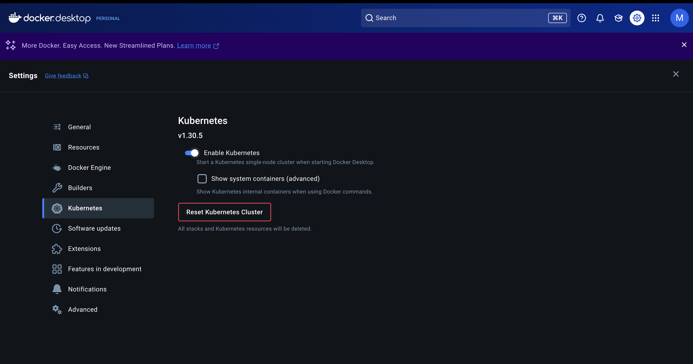

## 1.쿠버네티스 설치

### 1.1. 쿠버네티스 종류
쿠버네티스도 도커마냥 쿠버네티스 하나 이러면 얼마나 좋을까

쿠버네티스가 구글에서 개발되었다고 하지만 구글이 클라우드 네이티브 컴퓨팅 재단(이하 CNCF)를 조직하면서 이 재단에서 쿠버네티스를 기부하여 오픈소스로 전환되었다.

이렇게 되면서 다양한 버전의 쿠버네티스가 나오기 시작했고 버전에 따른 서드파티 소프트웨어가 여럿 나오기 시작한다.

이들 어플리케이션는 서로 호환이 가능한데, 이 호환성이 검증된 소프트웨어나 서비스는 `Certified Kubernetes` 인증을 받게 된다.

[Certified Kubernetes](https://www.cncf.io/training/certification/software-conformance/)에서 확인할 수 있다.

### 1.2. 도커 데스크탑 쿠버네티스 사용하기

쿠버네티스는 최소 마스터 노드와 워커 노드 두가지의 물리적 서버가 필요하다.

쿠버네티스를 사용한다는 전제는 대규모 서비스에서 다중 서버를 관리한다 이다.

하지만 작은 사이즈의 서비스나 혼자 실습하기 위해서 두대의 컴퓨터를 준비할 순 없지 않은가.

이러한 상황을 위해서 존재하는 쿠버네티스가 있다.

바로 도커 데스크탑에서 제공하는 쿠버네티스와 `Minikube`이다.

이 둘에서는 단일 서버에서 워커노드와 마스터 노드 두개 다를 돌려준다.

`Minikube`의 경우 실제 서비스 적용을 위해 `Linux`환경에서 사용해보도록 하고 이번 실습에서는 도커 데스크탑으로 진행하겠다

실행방법은 간단하다.



설정 -> kubernetes -> Enable Kubernetes
해주면 된다.

다음 터미널에서
```
> kubectl version

Client Version: v1.31.3
Kustomize Version: v5.4.2
Server Version: v1.30.2
```
을 확인해보면된다.

## 2. Nginx Pod 실습
간단하게  파드 한개 만들고 가보겠다
예제는 [공식 사이트](https://kubernetes.io/ko/docs/concepts/workloads/pods/)에서 참고했다
### 2.1. 매니페스트 파일
```yaml
apiVersion: v1 // API그룹 및 버전
kind: Pod // 리소스 유형
metadata:
  name: nginx
spec:
  containers:
  - name: nginx
    image: nginx:1.14.2
    ports:
    - containerPort: 80
```
다음은 간단한 nginx 이미지를 올리는 파드 매니페스트 yaml파일이다.

이때 이 매니페스트 파일을 살펴보자면 크게
```yaml
apiVersion:
kind:
metadata:
spec:
```
으로 이루어져 있다.
#### 2.1.1.  apiVersion
아래 kind와 함께 리소스를 정의하기 위한 항목이다.

사용자가 정의하려는 리소스가 어떤 api 그룹에 속하는지 파악하고 kubernetes에게 알려준다.

각 리소스가 어떤 api 그룹에 속하였는지 알아보려면 사용하는 kubernetes에서
```
kubectl api-resources
```
를 통해 확인해볼 수 있다.

#### 2.1.2. kind
리소스의 종류이다.

#### 2.1.3. metadata

리소스의 이름이나 레이블을 설정한다.

| 항목                | 내용                     |
| ----------------- | ---------------------- |
| name              | 리소스의 이름. 문자열로 된 유일 식별자 |
| namespace         | 리소스를 세분화한 DNS 호환 레이블   |
| uid               | 유일 식별자                 |
| resourceVersion   | 리소스 버전                 |
| generation        | 생성 순서를 나타내는 번호         |
| creationTimestamp | 생성 일시                  |
| deletionTimestamp | 삭제 일시                  |
| label             | 임의의 레이블                |
| anotation         | 리소스에 설정할 값             |

#### 2.1.4. spec

### 2.2. 실행
아래의 명령어로 pod를 생성시킬 수 있다.
```
kubectl apply -f nginx-pod.yaml
```

생성 이후 아래의 명령어로 확인할 수 있다.
```
kubectl get pods
```

### 2.3. localhost nginx 접속 실패

도커에서 컨테이너 내부와 외부의 네트워크는 서로 독립적이다. 하지만 파드 내부의 네트워크는 파드의 컨테이너가 공유하여 사용하게 된다. 여기서 파드의 네트워크는 로컬 컴퓨터의 네트워크와 독립적으로 분리 되어 있기 때문에 띄운 Nginx에 요청을 보내도 응답이 없을 것이다.

따라서 띄운 Nginx에 접근하는 방법은 2가지가 있다.

1. 파드 내부로 들어가서 접근하기
2. 파드의 내부 네트워크를 외부에서도 접속할 수 있도록 포트 포워딩 하기

#### 2.3.1. 파드 내부로 접속하기
아래의 명령어로 pod로 접근할 수 있다.
```
kubectl exec -it nginx-pod -- bash
```

#### 2.3.2. 포트 포워딩
아래의 명령어로 pod에 포트포워딩을 할 수 있다.
```
sudo kubectl port-forward pod/nginx-pod {local port}:{pod port}
```

### 2.3. 파드 삭제
```
kubectl delete pod nginx-pod
```


## 3. Spring Backend 올리기
Spring 코드 작성은 생략

### 3.1. Docker 이미지 생성
Dockerfile을 통해 이미지 생성

```Dockerfile
FROM openjdk:17-jdk  
  
COPY build/libs/*SNAPSHOT.jar app.jar  
  
ENTRYPOINT ["java", "-jar", "/app.jar"]
```

```bash
docker build -t spring-server .
```

### 3.2. 메니페스트 파일 작성
이후 메니페스트 파일 작성

```yaml
apiVersion: v1  
kind: Pod  
  
metadata:  
  name: spring-pod  
  
spec:  
  containers:  
    - name: spring-container  
      image: spring-server  
      ports:  
        - containerPort: 8080
```

```bash
% kubectl apply -f spring-pod.yaml
pod/spring-pod created
% kubectl get pods
NAME         READY   STATUS         RESTARTS   AGE
spring-pod   0/1     ErrImagePull   0          8s
% kubectl get pods
NAME         READY   STATUS             RESTARTS   AGE
spring-pod   0/1     ImagePullBackOff   0          21s
```
생성되었지만 실행이 안됨 -> ImagePull 실패

#### 3.2.1. 이미지 풀 정책 (Image Pull Policy)
이미지 풀 정책이란 쿠버네티스가 파드를 생성할때 이미지를 어떻게 가져올 것인지에 대한 정책
##### 3.2.1.1. `Always`
로컬에서 이미지를  가져오지 않고 레지스트리(dockerhub와 같은 원격 이미지 저장소)에서 가져옴
##### 3.2.1.2. `IfNotPresent`
로컬에서 이미지를 먼저 가져오고, 없을 경우 레지스트리에서 가져옴
##### 3.2.1.3. `Never`
로컬에서만 가져옴

```yaml
apiVersion: v1  
kind: Pod  
  
metadata:  
  name: spring-pod  
  
spec:  
  containers:  
    - name: spring-container  
      image: spring-server  
      imagePullPolicy: Never  
      ports:  
        - containerPort: 8080
```

#### 3.3. 여러개 띄우기

쿠버네티스에서 한  여러개의 파드를 동시 띄우고 싶을때 `---`을 통해 각 파드를 구분하고 띄울수 있다.

```yaml
apiVersion: v1  
kind: Pod  
  
metadata:  
  name: spring-pod-1
  
spec:  
  containers:  
    - name: spring-container  
      image: spring-server  
      ports:  
        - containerPort: 8080
---
apiVersion: v1  
kind: Pod  
  
metadata:  
  name: spring-pod-2
  
spec:  
  containers:  
    - name: spring-container  
      image: spring-server  
      ports:  
        - containerPort: 8080
```
여기서 metadata의 name은 고유한 값이어야 한다.

# 4. 파드 디버깅

실행되는 파드에 대해 다음 명령어로 디버깅을 할 수 있다

```bash
kubectl describe pod {파드명}
```

다음은 일부러 없는 버전의 `nginx`(1.26.4)의 pod를 실행하여 디버깅을 해본것이다.

 ```bash
 kubectl describe pods nginx-pod 
Name:             nginx-pod
Namespace:        default
Priority:         0
Service Account:  default
Node:             docker-desktop/***.***.***
Start Time:       Mon, 16 Dec 2024 15:19:36 +0900
Labels:           <none>
Annotations:      <none>
Status:           Pending
IP:               **.*.*.**
IPs:
  IP:  **.*.*.**
Containers:
  nginx:
    Container ID:   
    Image:          nginx:1.26.4
    Image ID:       
    Port:           80/TCP
    Host Port:      0/TCP
    State:          Waiting
      Reason:       ErrImagePull
    Ready:          False
    Restart Count:  0
    Environment:    <none>
    Mounts:
      /var/run/secrets/kubernetes.io/serviceaccount from kube-api-access-pplbs (ro)
Conditions:
  Type                        Status
  PodReadyToStartContainers   True 
  Initialized                 True 
  Ready                       False 
  ContainersReady             False 
  PodScheduled                True 
Volumes:
  kube-api-access-pplbs:
    Type:                    Projected (a volume that contains injected data from multiple sources)
    TokenExpirationSeconds:  3607
    ConfigMapName:           kube-root-ca.crt
    ConfigMapOptional:       <nil>
    DownwardAPI:             true
QoS Class:                   BestEffort
Node-Selectors:              <none>
Tolerations:                 node.kubernetes.io/not-ready:NoExecute op=Exists for 300s
                             node.kubernetes.io/unreachable:NoExecute op=Exists for 300s
Events:
  Type     Reason     Age                From               Message
  ----     ------     ----               ----               -------
  Normal   Scheduled  37s                default-scheduler  Successfully assigned default/nginx-pod to docker-desktop
  Normal   Pulling    20s (x2 over 37s)  kubelet            Pulling image "nginx:1.26.4"
  Warning  Failed     19s (x2 over 35s)  kubelet            Failed to pull image "nginx:1.26.4": Error response from daemon: failed to resolve reference "docker.io/library/nginx:1.26.4": docker.io/library/nginx:1.26.4: not found
  Warning  Failed     19s (x2 over 35s)  kubelet            Error: ErrImagePull
  Normal   BackOff    7s (x2 over 34s)   kubelet            Back-off pulling image "nginx:1.26.4"
  Warning  Failed     7s (x2 over 34s)   kubelet            Error: ImagePullBackOff
```

다음과 같이 Error가 찍히는 것을 확인해볼 수 있다.

또한 
 ```bash
 kubectl logs {파드명}
```

을 통해 로그도 확인해 볼 수 있다.
## 출처

### 참고사이트
[비전공자 쿠버네티스 입문 실전](https://www.inflearn.com/course/%EB%B9%84%EC%A0%84%EA%B3%B5%EC%9E%90-%EC%BF%A0%EB%B2%84%EB%84%A4%ED%8B%B0%EC%8A%A4-%EC%9E%85%EB%AC%B8-%EC%8B%A4%EC%A0%84#reviews)
