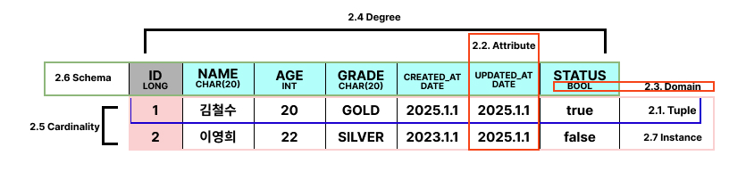

# 1. 관계 모델 (Relation Modek)

일관된 구조와 언어를 사용하여 데이터를 관리하는 접근 방식, 데이터는 모두 그룹화된 튜플로 관리된다.

데이터 베이스를 2차원 테이블로 관리하는 것이 특징이다.

# 2. RDBMS
관계형 모델을 구현한 DBMS를 지칭한다.

RDBMS에서 사용하는 기본적인 용어를 짚어보고 가자

## 2.1. 튜플 (Tuple)
테이블에서 말하는 행(row)이며, 파일의 레코드에 대응하는 개념이다. 즉, 한 객체의 데이터를 의미한다.

## 2.2. 속성 (Attribute)
테이블의 열(column)이다. 파일의 필드에 대응하는 개념이다.

## 2.3. 도메인(Domain)
속성(attribute)가 가질 수 있는 모든 값의 집합이다. 해당 Column의 데이터 타입이라고 생각하면 된다.

## 2.4. 차수 (Degree)
하나의 릴레이션의 속성 전체 갯수
일반적으로 자주 변하지 않는 정적인 특징이다

## 2.5. 기수 (Cardinality)
하나의 릴레이션의 튜플의 전체 갯수
자주 변한다

## 2.6. 스키마
릴레이션 스키마는 릴레이션 자체의 이름과 그 속성들을 정의하는 논리적 구조를 의미한다.

## 2.7. 인스턴스
어느 한 시점에서의 릴레이션에 존재하는 튜플의 집합체를 의미한다.

# 3. RDBMS의 특성

1. 튜플의 유일성
   하나의 릴레이션에는 동일한 튜플이 존재할 수 없다.
   모든 튜플에는 다른 튜플과 구별되는 유일한 특성이 있어야 한다.
   이러한 유일성을 선정하는 속성 (혹은 속성들)을 키라고 부른다
   이러한 키를 가지고 있는 이유는 이 키를 활용하여 투플에 쉽게 접근하기 위해서 이다.
2. 투플의 무순서
   하나의 릴레이션에서 투플 사이의 순서는 무의미하다.
   투플의 순서와 상관없이 같은 내용의 투플을 가지고 있다면 같은 릴레이션으로 취급해야한다.
   SET이라고 생각하며 된다
3. 속성의 무순서
   속성의 순서가 바뀌어도 상관없이 같은 릴레이션이다. 
4. 속성의 원자성
   모든 속성값은 더는 분해할 수 없는 하나의 값, 즉 원자 값만 가질 수 있다.
   또한 다중 값을 가질 수 없다

# 4. 키 (Key)
튜플을 구별하기 위해 각 투플의 모든 속성을 비교하는 것보다 그 튜플을 대표할 수 있는 일부 속성만을 이용하는 것이 효율적이다.

릴레이션에 포함된 튜플들을 유일하게 하여 구별해주는 속성 혹은 속성들의 집합을 키라고 한다.

키에는 5가지의 분류가 있다.

## 4.1. 슈퍼키 (Super Key)
슈퍼키는 유일성의 특성을 만족하는 속성 또는 속성들의 집합이다.
위의 사진에서는  AGE나 GRADE의 경우 그 값이 유일하지 않다. 다른 튜플에서도 나이가 20이나 22가 될 수있고 등급도 GOLD나 SILVER가 될 수 있다. 하지만 ID나 NAME은 유일할 수 있으므로 슈퍼키가 될 수 있다.

## 4.2. 후보키(Candiate Key)
 후보키는 유일성과 최소성을 만족하는 속성 또는 속성들의 집합이다. 최소성이랑 꼭 필요한 최소한의 속성을 의미한다. 때문에 후보키는 슈퍼키 중 꼭 필요한 (최소성을 만족하는) 속성들을 후보키라고 한다.

## 4.3. 기본키 (Primary Key)
릴레이션에서 투플을 구별하기 위해 꼭 여러개의 후보키를 사용할 필요는 없다. 여러개의 후보키 중 기본적으로 사용할 키를 기본키라고 한다.

## 4.5. 대체키 (Alternate Key)
기본키로 선택되지 못한 후보키들을 의미한다.

## 4.6. 외래키 (Foreign Key)
어떤 릴레이션의 속성이 다른 릴레이션의 기봄키가 되는 키다. 다른 릴레이션과의 관계를 나타낼때 사용되는 키이다.

# 5. 무결성 제약 조건 (Integrity Contraint)

무결성은 데이터에 결함이 없는 상태, 즉 데이터가 정확하고 유효하게 유지된 상태를 의미한다.

## 5.1. 도메인 무결성 제약 조건
속성은 해당 속성의 도메인 값외에는 가지면 안된다는 규칙이다.

## 5.2. 개체 무결성 제약 조건
기본키를 구성하는 모든 속성은 NULL값을 가지면 안된다는 규칙이다.

## 5.3. 참조 무결성 제약 조건
개체 무결성 제약 조건은 각 릴레이션의 기본키에 적용되는 것이라면 참조 무결성 제약 조건은 외래키에 적용되는 조건이다.

참조 무결성 제약 조건은 외래값은 참조할 수 없는 값을 가질 수 없다는 규칙이다.

예를 들어 해당 키가 참조 릴레이션에 존제하지 않거나 NULL값을 가질 수 없다.