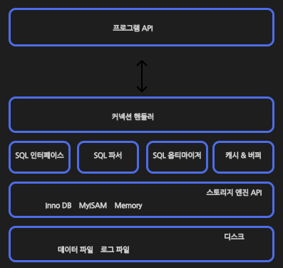

# 1. MySQL 

앞선 포스트에서  RDBMS에 대해 알아보았다

RDBMS로는 MySQL과 MariaDB, Oracle이 유명하다.

[트랜드 분석](https://db-engines.com/en/ranking)을 보면 Orcle 다음으로 MySQL이 유행하는 RDBMS이다.

MySQL은 처음에는 오픈소스로 96년도에 공개되었다. 이후 오라클에 인수되면서 커뮤니티 에디션과 에터프라이즈 에디션으로 나뉘어 운영되게 되었다.

Oracle이 많이 쓰이는 이유는 고성능의 트랜잭션 처리와  테이블, 인덱스 최적화 등 다양한 기능을 제공한다. 반면에 MySQL의 경우 복잡한 쿼리의 경우 성능 저하가 있을 수 있으며 트랜잭션이 지원이 완벽하지 않는 등 여러 문제들이 있다.

하지만 그럼에도 불구하고 MySQL을 다양한 대기업에서 사용하는 이유는 바로 경쟁력과 비용일 것이다. 대용량 데이터를 저장하기에는 오라클은 너무 비싸다. 때문에 상황에 따라 적당한 DBMS를 선택할 줄 알아야한다.

## 1.1. MySQL엔진 아키텍쳐

