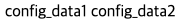

# 1. 환경변수 관리

Spring 부트 서버의 `application.yml`과 같이 사용될 환경변수들을 쿠버네티스에서 관리하는 방법이다.

우선 
- application.yml

```yml
spring :  
  application :  
    name : demo  
  
secret :  
  data1 : 'data1'  
  data2 : 'data2'
```

과 같은 상황에서 부트서버에서 위 변수들을 사용하고 싶을때

```kotlin
@RestController  
class AppController(  
    @Value("\${secret.data1}")  
    private val data1 : String,  
    @Value("\${secret.data2}")  
    private val data2 : String  
) {  
    @GetMapping("/")  
    fun home() : String{  
        return "Version 1.0"  
    }  
  
    @GetMapping("/data")  
    fun data() : String{  
        return "$data1 $data2";  
    }  
}
```

이와 같이 가져와 줄 수 있다.

이때 여러 파드에서 해당 변수 (예를들어 db 개정이나 ip 등)을 공통적으로 관리하면 중복된 변수 설정이나 보안적으로 안전하게 관리할 수 있게 된다.

## 1.1. deployment에서 관리하기

```yaml
apiVersion: apps/v1  
kind: Deployment  
  
metadata:  
  name: spring-deployment  
  
spec:  
  replicas: 3  
  selector:  
    matchLabels:  
      app: backend-app  
  
  template:  
    metadata:  
      labels:  
        app: backend-app  
    spec:  
      containers:  
        - name: spring-container  
          image: spring-server  
          imagePullPolicy: IfNotPresent  
          ports:  
            - containerPort: 8080  
	      
	      ## 여기서 설정함
          env:  
            - name: secret.data1  
              value: config_data1  
            - name: secret.data2  
              value: config_data2
```
위와 같이 관리할 경우 기존 스프링에서 환경 변수를 설정할 것을 덮어서 관리할 수 있다.

이후 k8s를 띄우고 접속해보면



다음과 같이 출력되는 것을 확인할 수 있다.

이 후 해당 파드에 접속하여 env를 확인해보면

```bash
kubectl exec -it spring-deployment-**** -- bash
bash-4.4# env
## 생략
secret.data2=config_data2
secret.data1=config_data1
```

환경변수도 변경된 것을 확인할 수 있다.

하지만 위와 같이 deployment에서 관리를 할 경우 다른 환경에서 서버를 실행할때 유연하게 교체하기 힘들다.

## 2.  ConfigMap을 활용한 환경변수 분리


Springboot에서는 설정값(properties)를 `application.yml`로 관리를 한다.

이때 dev, test, product 환경에따라 yml을 분리하여 관리할 수 있는데 k8s에서도 이를 분리하여 관리할 수 있다.

ConfigMap은 위와 같이 환경변수를 환경에 따라 분리하여 관리를 해주는 오브젝트이다.

- spring-config.yml

```yml
apiVersion: v1  
kind: ConfigMap  
  
metadata:  
  name: spring-config  
  
data:  
  secret.data1: 'config_map_data1'  
  secret.data2: 'config_map_data2'
```

이렇게 할 경우 configmap에서 secret.data1에는 해당 값을 저장하는 식으로 운영을 하게된다.

이 후  deployments.yaml에서는
- deployments.yml
```yml
### 생략

  template:  
  
		### 생략
		env:  
			### 환경변수명
		  - name: secret.data1  
			### 외부에서 가져오겠다는 의미
			valueFrom:  
			.  ### configmap을 사용하겠다는 의미
			  configMapKeyRef:  
				### 사용할 configmap 이름
				name: spring-config  
				### 사용할 키
				key: secret.data1  
		  
		  - name: secret.data2  
			valueFrom:  
			  configMapKeyRef:  
				name: spring-config  
				key: secret.data2
```


# 출처

[비전공자 쿠버네티스 입문 실전](https://www.inflearn.com/course/%EB%B9%84%EC%A0%84%EA%B3%B5%EC%9E%90-%EC%BF%A0%EB%B2%84%EB%84%A4%ED%8B%B0%EC%8A%A4-%EC%9E%85%EB%AC%B8-%EC%8B%A4%EC%A0%84#reviews)
