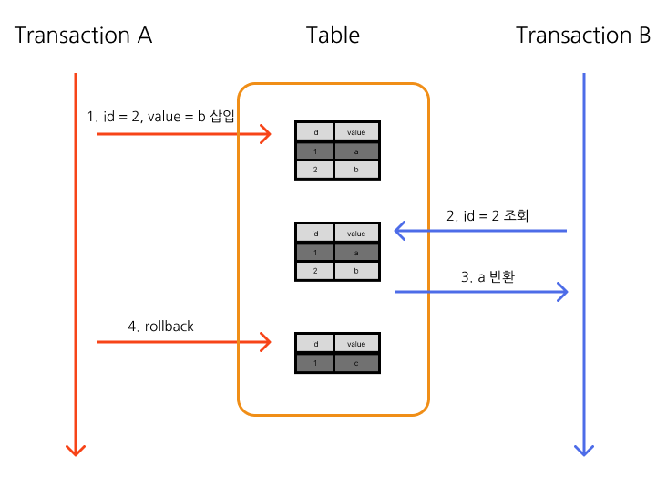
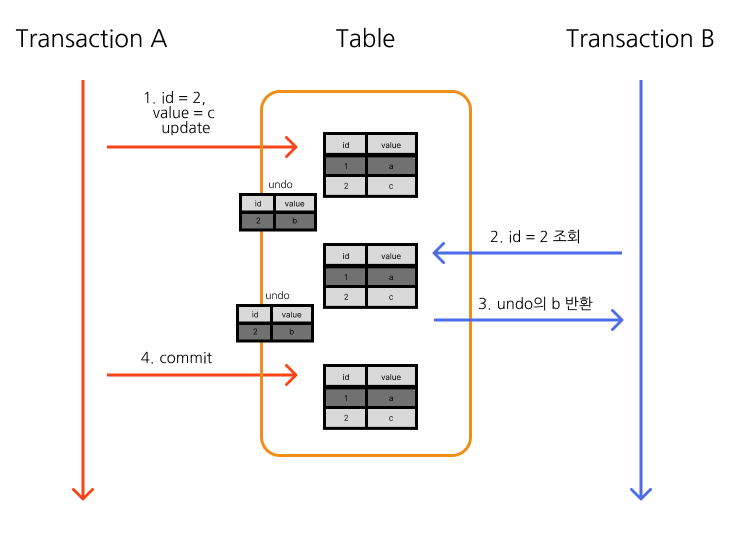

# 1. 트랜잭션

## 1.1. 트랜잭션이란

> 작업 하나를 수행하는데 필요한 데이터베이스의 연산들을 모아놓은 논리적인 작업 단위

일반적으로 DB의 연산은 SQL로 표현되므로 작업 수행에 필요한 SQL 문들의 모임으로 이해해도 된다.

데이터베이스는 다수의 사용자가 사용하더라도 무결성과 일관성을 보장하여야한다.

또한 연산 과정에서 장애가 발생하더라도 빠른 시간 내에 원래 상태로 회복하여야 한다.

데이터베이스는 트랜잭션을 통해 작업 단위를 관리함으로서 장애 대응과 병행 제어를 한다.
## 1.2. ACID

트랜잭션이 데이터베이스의 무결성과 일관성을 보장하기 위해선 아래 ACID라는 4가지 특성을 만족하여야 한다.

- Atomicity (원자성) 
- Consistency (일관성)
- Isolation (고립성)
- Durability (지속성)

### 1.2.1. Atomicity (원자성)

> 트랜잭션을 구성하는 연산들이 모두 성공하거나 모두 실패하여야 한다.

한 단위의 트랜잭션을 수행하다 장애가 발생하여 해당 트랜잭션을 완료하지 못할 경우, 앞서 수행한 작업을 트랜잭션 이전 상태로 되돌려 원자성을 보장해아한다.

이를 통해 한 트랜잭션에서는 트랜잭션을 구성하는 연산 중 일부만 처리하는 결과를 반영하는 일이 없어야 하는 것이다.

또한 이 원자성을 만족하기 위해서는 트랜잭션은 이전 상태로 되돌리는 회복 기능이 필요하다

### 1.2.2. Consistency (일관성)

> 트랜잭션이 성공적으로 수행된 이후에도 데이터베이스는 일관된 상태를 유지하여야 한다.

> 특정 트랜잭션의 영향을 받는 데이터는 허용된 방식으로만 변경해야 한다.

표현이 조금 어려울 수도 있는데, 이는 트랜잭션의 결과가 제약조건을 지켜야한다는 의미이다.

예를 들어 계좌가 0보다 크거나 같아야한다는 제약조건이 있는 데이터베이스에서 트랜잭션은 이를 지켜야 일관성을 만족한다고 할 수 있는 것이다.

### 1.2.3. Isolation (격리성, 고립성)

> 수행중인 트랜잭션이 완료될 때까지 다른 트랜잭션이 중간 연산에 개입 할 수 없어야 한다.

일반적으로 데이터베이스는 여러 트랜잭션이 동시에 수행되지만, 서로 연산 결과가 격리 되어야한다.

### 1.2.4. Durability (지속성, 영속성)

> 트랜잭션이 완료된 후 데이터베이스에 반영된 결과는 손실 없이 영구적이어야 한다.

시스탬 장애가 발생하더라도 영구적으로 데이터베이스가 남아있어야 한다는 의미이다.

### 1.2.4. ACID를 지원하는 기능들

DBMS는 위 특성을 보장하기 위해 아래와 같은 기능을 제공한다.

| 특성  | 기능    |
| --- | ----- |
| 원자성 | 회복    |
| 일관성 | 병행 제어 |
| 격리성 | 병행 제어 |
| 지속성 | 회복    |

## 1.3. 트랜잭션의 연산

DB에 사용자가 접속을 하게 되면 물리적인 연결 (connection)을 통해 통신을 하게 된다. 이 연결을 통해 논리적인 상호작용을 하게 되는데(session) 이 세션 내에서 모든 트랜잭션 작업이 이루어지게 된다.

즉 커넥션은 TCP/IP 프로토콜과 같은 물리적인 네트워크 연결을 의미하고, 세션(session)은 이 연결에서 이루어지는 논리적인 작업들을 의미한다.

이 세션에서 이루어지는 트랜잭션 연산은 해당 트랜잭션의 성공과 실패에 따라 나뉘게 된다.

- commit - 성공시
- rollback - 실패시
### 1.3.2. commit

트랜잭션이 성공적으로 완료되었음을 선언하는 연산

commit이 실행되면 수행 결과를 데이터베이스에 반영하여 지속성을 유지하게 된다.

### 1.3.3. rollback

트랜잭션이 실패하였음을 선언하는 연산

수행 결과를 번복하고 수행 이전의 상태로 되돌아가 원자성과 일관성을 보장하게 된다.
## 1.4. 트랜잭션 격리 수준

트랜잭션 격리 수준 (Isolation Level)이란 여러 트랜잭션을 동시에 처리할때 특정 트랜잭션이 다른 트랜잭션이 변경, 조회하는 테이블을 볼 수 있게 허용할지 말지에 대한 정도를 표현한 것이다.

4가지의 격리 수준이 존재하며 아래로 갈 수록 제약이 심해진다.

각 격리 수준에서 발생할 수 있는 부정합 문제가 있다.

|                 | DIRTY READ | NON-REAPEATABLE READ | PHANTOM READ        |
| --------------- | ---------- | -------------------- | ------------------- |
| READ UNCOMMITED | O          | O                    | O                   |
| READ COMMITED   | X          | O                    | O                   |
| REPEATABLE READ | X          | X                    | O (MySQL InoDB는 없음) |
| SERIALIZABLE    | X          | X                    | X                   |

### 1.3.1. READ UNCOMMITED

> READ UNCOMMITED 격리 수준에서는 각 트랜잭션에서의 변경 내용이 COMMIT이나 ROLLBACK 여부에 상관 없이 다른 트랜잭션에서 조회가 가능하다

가장 낮은 수준의 격리이다.

때문에 다양한 부정합 문제가가 발생하는데 가장 대표적인 것이 Dirty Read이다
#### 1.3.1.1. Dirty Read

> 어떤 트랜잭션에서 처리한 작업이 완료되지 않았음에도 다른 트랜잭션에서 볼 수 있는 현상

두개의 트랜잭션이 동시에 수행되고 있다고 가정하자

A 트랜잭션은 id = 2, value = b을 삽입하는 작업을 수행한다.

B 트랜잭션은 id=2을 조회하는 작업을 수행한다.

이때 A의 작업이 끝나지 않은 상태에서 B가 id = 1 을 조회하면 a를 반환하는데 A가 롤백을 하면서 id = 2는 존재하지 않게 되었지만 B는 이를 정상적인 데이터라고 인식하게 된다.

이는 commit이 완료되지 않은 데이터를 조회하면서 발생하는 현상이다.
### 1.3.2. READ COMMITED

> READ COMMITED 격리 수준에서는 commit이 완료된 데이터만 다른 트랜잭션에서 조회할 수 있다

Dirty Read를 방지하는 격리 수준이다. 

위 상황에서 commit이 완료되지 않았기때문에 대기하게 되고 정상적으로 존재하지 않다는 응답을 받게 될 것이다.

READ COMMITED에서 update 데이터에 접근한다면 어떻게 처리할까?

undo 영역에 변경전 데이터를 백업하고 다른 트랜잭션이 해당 정보를 참고하여 update로직을 처리한다.

즉 트랜잭션의 작업이 완료될때까지 다른 트랜잭션은 변경 내역을 조회할 수 없게한다.

READ COMMITED에서는 NON-REPEATABLE READ 라는 부정합 문제가 발생할 수 있다.

#### 1.3.2.1. NON-REPEATABLE READ

> 한 트랜잭션 내에서 동일한 질의가 다른 결과를 반환하는 현상

동일한 쿼리임에도 다른 결과가 반환된다면 이는 정합성에 어긋난다.

![[assets/img/post/2025-01-30/non_reapeatble.png]]

다음과 같은 현상에서 A가 B의 두 조회 쿼리 사이에 커밋이 나서 차이가 발생할 경우 두 조회 결과가 달라지는 문Non-Repeatable 부정합이 발생하게 된다.

### 1.3.3. REPEATABLE READ

> 하나의 트랜잭션 내의 동일한 조회 문의는 같은 결과를 반환해야 한다.

NON-REPEATABLE READ를 방지하는 격리 수준이다.

![[assets/img/post/2025-01-30/repeatable_read.png]]

Undo 영역에 변경전 데이터를 백업하고 실제 레코드 값을 변경한다.

해당 트랜잭션이 실행되기전 그 데이터를 참고하고 있던 트랜잭션들은 실제 레코드 값이 아닌 Undo 영역의 백업 데이터를 참고한다.

DBMS는 해당 백업 데이터가 쓸모없다고 판단시 백업을 처리하게 된다.

MySQL의 경우 특정 트랜잭션 번호 구간 내(해당 데이터를 물고있는)에서 백업 Undo 데이터를 관리한다.

Reapeatable read에서는 select for update 문에 의해 Phantom Read가 발생할 수 있다.

#### 1.3.3.1. Phantom Read

> 다른 트랜잭션의 작업에 의해 작업 대상 레코드가 계속 변경되는 현상

![[phantom_read.png]]

일반적인 조회와 다르게 Select for update는 해당 레코드에 lock을 걸지만 undo영역에는 lock을 걸 수 없기 때문에 조회시 실제 레코드를 조회하게 된다.

때문에 다른 트랜젝션의 변경 사항이 있을 시 undo 영역에 백업을 하여도 실제 레코드를 참조하여 변경 데이터를 참조하게 되는 현상이다.
### 1.3.4. SERIALIZABLE

> 한 트랜잭션에서 읽고 쓰는 레코드를 다른 트랜잭션에서 접근을 하지 못한다

가장 엄격한 격리 수준이다.

동시 처리 성능이 떨어진다.

위에서 발생할 수 있는 부정합이 발생하지 않는다.
### 1.3.5. DBMS 별 격리 수준

| DBMS       | 격리수준            |                                         |
| ---------- | --------------- | --------------------------------------- |
| Oracle     | READ COMMITED   |                                         |
| MySQL      | REPEATABLE READ | InnoDB에서는 Non-Repeatable read가 발생하지 않는다 |
| PostgreSQL | READ COMMITED   |                                         |
| MariaDB    | REPEATBLE READ  |                                         |
| MongoDB    | READ_UNCOMMITED |                                         |

#### 1.3.4.1. MySQL InnoDB의 PhantomREAD

> SQL-92, SQL-99 표준에 따르면 REPEATABLE READ 격리 수준에서는 PHANTOM READ가 발생할 수 있지만, InnoDB에서는 독특한 특성 때문에 REPEATABLE READ 격리 수준에서도 PHANTOM READ가 발생하지 않는다.

InnoDB는 Undo log와 트랜잭션 번호를 통해 Phantom Read를 방지는데,

트랜잭션이 레코드를 조회할때 자신보다 큰 (늦게 실행한 트랜잭션) 트랜잭션 번호를 무시하며 조회를 한다.

따라서 위에서 트랜잭션 A가 변경한 사항은 조회하지 않기 때문에 Phantom Read를 방지할 수 있는 것이다.
# 2. 동시성 제어

DBMS는 여러 사용자가 동시에 DB를 공유할 수 있도록 여러개의 트랜잭션을 동시에 수행하는 동시성(concurrency)를 제공한다.

동시성은 보통 트랜잭션을 차례로 번갈아 수행하는 인터리빙(interleaving) 방식으로 구현된다.

하지만 동시에 같은 데이터에 접근을 하면 여러 공유자원에 대한 문제가 발생할 수 있다.

DBMS는 각 트랜잭션이 서로 방해가 되지 않게 동시성을 제어해야한다.

## 2.1. DB 동시성 문제

DB의 동시성 문제는 대표적으로 갱신 분실, 모순성, 연쇄 복귀가 있다.

### 2.1.1. 갱신 분실 (lost update)

> 하나의 트랜잭션 연산 결과가 다른 트랜잭션의 결과에 덮어져 무효화되는 문제

| transaction a | transaction b | db       |
| ------------- | ------------- | -------- |
| read(x);      |               | x = 1000 |
| x = x + 1000; |               |          |
|               | read(x);      |          |
| write(x)      |               | x = 2000 |
|               | x = x - 500;  |          |
|               | write(x)      | x = 500  |
 
 트랜잭션이 순차적으로 됐을 경우
 
 `1000 + 1000 - 500 = 1500`
 
 이 되었어야 하지만

a의 결과가 분실되어 `500`이 반영되게 된다.
### 2.1.2. 모순성 (inconsistency)

> 하나의 트랜잭션이 여러 개의 변경 연산을 실행할때 일관성 없는 상태의 db 데이터를 연산하면서 모순된 결과가 반영되는 문제

트랜잭션이 여러 연산을 수행하면서 그 사이에 다른 트랜잭션의 연산 결과가 반영되면서 모순된 결과가 반영되는 문제이다.

예를 들어 선행 트랜잭션에서는 두 값에 1000을 더하고, 후행 트랜잭션에서는 이를 2로 나눈다고 하자.

결과는 
`x = 1000, y = 1000`
이지만

| transaction a | transaction b | db                     |
| ------------- | ------------- | ---------------------- |
| read(x);      |               | x = 1000, y = 1000     |
| x = x + 1000; |               |                        |
| write(x);     |               | x = 2000, y = 1000     |
|               | read(x);      | x = 2000, y = 1000     |
|               | x = x / 2;    |                        |
|               | write(x)      | x = 1000, y = 1000     |
|               | read(y);      | x = 1000, y = 1000  |
|               | y = y / 2;    |                        |
|               | write(y)      | x = 1000, y = 500      |
| read(y);      |               |                        |
| y = y + 1000; |               |                        |
| write(y);     |               | x = 1000, y = 1500     |

위와 같이 모순된 결과가 발생하게 된다.

### 2.1.3. 연쇄 복귀 (cascading rollback)

> 트랜잭션 완료 롤백 연산 실행시, 다른 트랜잭션의 변경 연산 또한 롤백 연산을 연쇄적으로 실행해야 하는 문제

트랜잭션 완료 전 다른 트랜잭션이 완료되면서 해당 트랜잭션의 변경 결과를 사용한다면, 롤백 연산에 문제가 발생할 수 있다.

| transaction a | transaction b | db       |
| ------------- | ------------- | -------- |
| read(x);      |               | x = 1000 |
| x = x + 1000; |               |          |
| write(x);     |               | x = 2000 |
|               | read(x);      | x = 2000 |
|               | x = x - 500;  |          |
|               | write(x);     | x = 1500 |
| rollback      |               |          |

위 상황에서 rollback이 되야 하지만 db에 이미 반영이 되어 롤백 연산에 문제가 생긴다.

## 2.2. 트랜잭션 스케쥴링

위와 같이 여러개의 트랜잭션을 처리하는 과정에서 데이터의 정합성 문제가 발생할 수 있다.

이는 각 트랜잭션의 처리 순서를 지킨다면 해결될 문제이지만 순서대로 다 처리한다면 대규모 트랜잭션 환경에서는 매우 비 효율적일 것이다.

이럴때 트랜잭션의 처리를 스케쥴링하는 방식이 있다.

### 2.2.1. 직렬 스케쥴링 (serial schedule)

인터리빙 방식이 아닌 들어온 모든 연산을 순차적으로 처리하는 방법이다.

모든 트랜잭션이 독립적으로 수행되기 때문에 정확하지만 동시적으로 각 트랜잭션이 처리되지 않기 때문에 비효율 적이다.

### 2.2.2. 비직렬 스케쥴링 (non serial schedule)

인터리빙 방식을 이용하여 트랜잭션을 동시적으로 수행시키는 방식이다.

효율적이지만 결과를 보장할 수 없기 때문에 위 여러 동시성 이슈가 발생한다.

이를 방지하기 위해 동시성 제어 기법들이 필요하다.

### 2.2.3. DB Lock

> 공유 자원에 대하여 다른 트랜잭션이 접근하지 못하도록 상호 배제하여 직렬 가능성을 보장

운영체제를 공부하다보면 해당 내용이 나온다. 공유 자원에 대해서 멀티쓰레드에서 발생할 수 있는 문제들이 있다.

이와 마찬가지로 트랜잭션도 락을 통해 공유 자원 (레코드) 접근을 제한하고 관리를 한다.

#### 2.2.3.1. Lock 종류

##### 2.2.3.1.1. 공유락 (shared Lock)

> 타 트랜잭션이 해당 데이터에 대한 read 연산은 실행할 수 있되, write 연산은 실행할 수 없다.

읽기락이라고도 불리며, 다른 트랜잭션들도 한 데이터에 대해 동시에 해당 lock을 얻을 수 있다.

##### 2.2.3.1.2. 베타락(exclusive lock)

> 타 트랜잭션이 해당 데이터에 대한 read, write 연산을 실행할 수 없다.

쓰기락이라고도 불리며, 한 트랜잭션만 가질 수 있다.

### 2.2.3. 교착 상태 (Deadlock)

각 트랜잭션이 자원을 독점하고 있는 상태에서 서로가 서로의 자원을 기다리며 unlock을 대기하며 무한정 정체되어 있는 상태를 의미한다.

교착 상태는 처음부터 발생하지 않도록 쿼리를 신중히 작성하거나, 발생시 빠르게 탐지하여 조치를 취해야 한다.

MySQL의 InnoDB의 경우 deadlock을 감지하여 해당 트랜잭션들을 rollback 시키는 기능이 존재한다.

# 3. 회복

트랜잭션은 원자성을 보장하기 위해 장애가 발생시 이전으로 상태로 되돌려야 한다.

데이터를 모순이 없는 일관된 상태로 복구시키는 기능을 회복 기능이라고 한다.

우선 DBMS에서 발생할 수 있는 장애를 알아보자

### 3.1. 장애 유형

장애에는 크게 3가지로 분류할 수 있다

### 3.1.1. 트랜잭션 장애

트랜잭션 수행중 오류 발생으로 정상적으로 작업을 수행할 수 없는 상태

트랜잭션의 논리적 오류, 잘못된 데이터, 시스템 자원의 과다한 사용, 처리 대상 데이터 부재 등

### 3.1.2. 시스템 장애

하드웨어의 결함으로 정상적으로 작업을 수행할 수 없는 상태

하드웨어 이상으로 메모리 손실, 교착 상태 등

### 3.1.3. 미디어 장애

디스크 장치의 결함

## 3.2. 회복기법

장애 발생시 이를 회복시키는 기법은 DBMS의 회복 관리자(recovery manager)가 담당한다

장애가 일어난 경우 복구하는 동안 다른 작업은 할 수 없기 때문에 최대한 빠른 시간내에 회복이 수행되어야 한다.

### 3.2.1. 회복 연산

회복에 사용되는 연산들이다.

#### 3.2.1.1. 백업 연산

회복의 원리는 데이터를 백업해두어 장애 발생시 이를 사용하여 복원하는 것이다.

아래에는 회복을 위해 사용되는 두가지 방법들이다.

| dump | 데이터베이스 전체를 다른 저장 장치에 주기적으로 복사 |
| ---- | ----------------------------- |
| log  | 변경 연산 마다 이전, 이후 값을 별도의 파일에 기록 |

#### 3.2.1.2. 회복 연산

장애 발생시 덤프나 로그를 이용하여 복구하는 방법이다.

| redo | 가장 최근에 저장한 데이터베이스 복사본(dump)를 복사본 이후의 로그를 통해 실행된 모든 변경 연산을 재실행하여 장애 발생전 상태로 복구 | 전반적으로 손상시 사용                |
| ---- | ----------------------------------------------------------------------------- | --------------------------- |
| undo | 로그를 이용해 지금까지 실행된 모든 변경 연산을 취소, 원래 상태로 복구                                      | 변경 중이거나 변경된 내용만 복구하여야 할때 사용 |

### 3.2.2. 로그 회복 기법

로그를 이용한 회복 기법으로, 연산 결과를 반영하는 시점에서 즉시 갱신과 지연 갱신 으로 나뉜다

#### 3.2.2.1. 즉시 갱신 회복 기법 (immediate update)

> 트랜잭션 수행 중의 연산 결과를 바로 변경 내역을 로그 파일로 기록 후, 데이터 베이스에 변경 연산을 반영한다.

즉시 갱신 회복 기법에서는 장애 발생 시점에 따라 회복 연산이 달라지는데

트랜잭션 완료 전에는 undo 연산을 실행하고 (<T, start>로그 존재, <T,commit> 로그 존재 x)

트랜잭션 완료 이후에는 redo 연산을 실행한다 (<T, start>, <T, commit> 둘다 존재)

#### 3.2.2.2. 지연 갱신 회복 기법 (deferred update)

> 트랜잭션 수행 중 변경 내역은 로그하되, 부분 완료 이후 로그 데이터를 활용하여 데이터 베이스에 일괄적으로 반영

지연 갱신 회복 기법에서는 로그 내역만 처리하면 되기 때문에 

트랜잭션 도중 장애 시 로그 내역만 버리고

트랜잭션 완료 이후에 redo 연산을 하면 된다.

### 3.2.3. 체크포인트 회복 기법

로그 회복 기법의 경우 로그 전체를 대상으로 회복할 너무 많은 시간이 걸리고, 불필요한 연산도 같이 수행되게 된다. 예를 들어 두개의 트랜잭션이 수행되 었고 한개의 트랜잭션만 성공적으로 commit되었음에도 불구하고 장애가 발생해 복구할 경우 완료된 트랜잭션의 작업 또한 rollback 되게 된다.

체크포인트 회복 기법은 로그 회복 기법과 같은 방식으로 로그 기록을 하되, 일정 시간 간격으로 검사 시점 (checkpoint)를 만들어 둔다.

장애 발생시 체크포인트를 기준으로 이전 트랜잭션에는 회복 수행을 진행하지 않고, 이후의 트랜잭션에만 회복을 수행한다.

체크포인트 시점이 되면 메인 메모리의 모든 로그 레코드를 로그 파일에 저장하고, 트랜잭션의 변경 내역을 데이터 베이스에 반영한다.

장애 발 생시 최근 체크포인트 로그를 찾고 그 이 후 로그 파일의 회복 작업을 수행한다.

### 3.2.4. 미디어 회복 기법

데이터베이스는 비휘발성 저장 장치인 디스크에 저장되는데, 하드웨어인 디스크의 손상에 의해 장애가 발생할 수 있다.

일정 주기마다 덤프를 통해 데이터를 전채 복사하여 물리적으로 다른 디스크에 저장하고, 장애 발생시 해당 데이터를 복사하고, 로그를 통해 redo를 하여 회복하는 방식이다.

# 4. 참고

[데이터베이스 개론 3판, 김연히 저, 한빛 아카데미]
[Real MySQL, 백은빈, 이성욱 저, 위키북스]