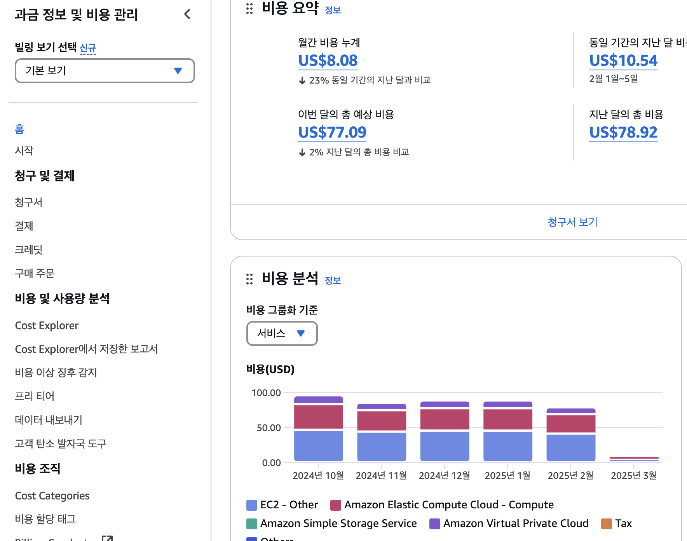
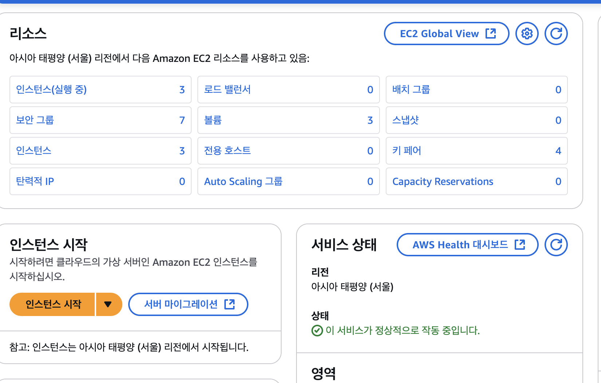
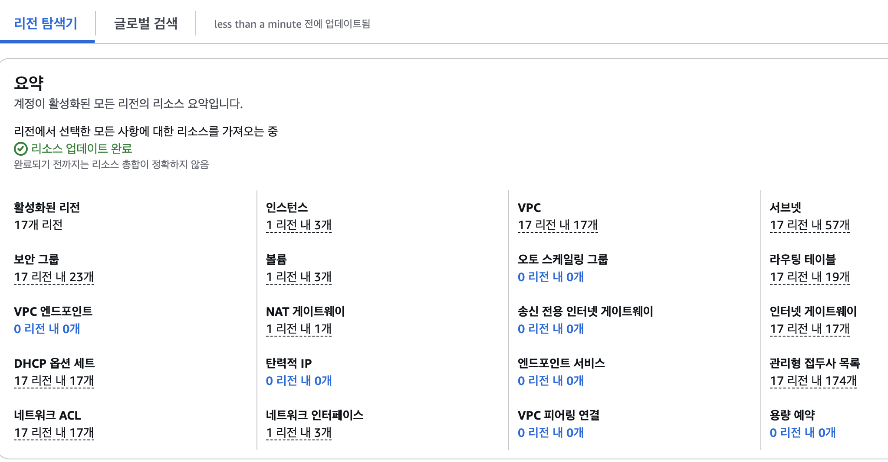

# 0. 서론
마피아 투게더는 AWS EC2를 통해 배포하고 있었다.

AWS startup 크래딧에서 2년동안 1000달러를 지원받아 사용하고 있었는데...

충분하다고 생각했던 금액이 어느세 200달러밖에 남지 않게 되었다.

도대체... 무슨일인가...

# 1. 비용 추적하기
AWS 서비스에서 `결제 및 비용 관리`를 확인해보자

다음과 같이 어떤 서비스를 사용했고 얼마나 사용했는지 확인할 수 있다.

여기서 가장 많이 사용되는 부분은 `EC2-Other`, `Amazon Elasttic Compute Cloud - compute`, `Amazon Virtual Private Cloud` 이렇게 3가지가있다.

`Amazon Elasttic Compute Cloud - compute`의 경우 EC2 인스턴스를 의미하니까 우선 제외하고 `EC2-Other`, `Amazon Virtual Private Cloud` 를 확인해 보았다.

# 2. 전체 리소스 확인하기

`EC2` 서비스에서

`EC2 Global View`를 통해 계정에서 사용중인 전체 리전을 탐색할 수 있다.

다음과 같이 확인할 수 있는데 위 사진은 불필요한 리소스들을 삭제한 상태이다.

예를 들어 NAT 게이트웨이(삭제시켰지만 위 사진에선 아직 반영되지 않음)의 경우 사용하고 있지 않았지만 예전 VPC를 생성한것을 깜빡하고 냅두어서 해당 부분에서 추가적인 비용이 발생하고 있었다.

또한 탄력적 IP또한 사용이 되어 EC2-Other에서 추가적인 비용이 발생한 것이다.

# 3. 결론

AWS Startup 크레딧으로 관리를 안하고 있었지만, 크레딧이 점점 줄어들고 있는 탓에 좀더 관리가 필요하다는 생각이 들게 되었다.

이전 VPC와 같이 여러 서비스를 크레딧을 믿고 사용해보려 시도하였지만 잊고있다가 불필요한 크레딧만 소모하게 되었다.

