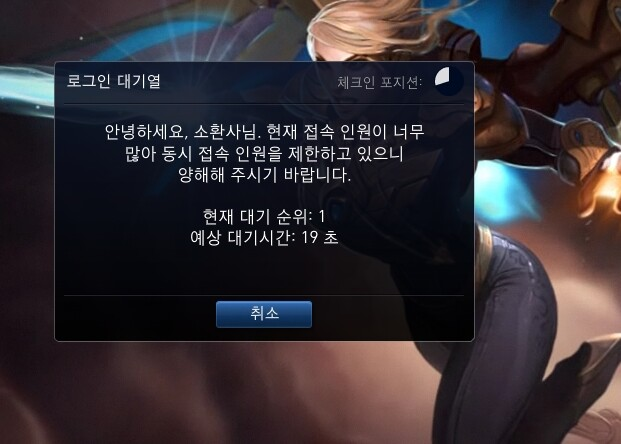

# 0. 서론
마피아 투게더를 진행하면서 어느정도 기능 완성은 되었고 서비스도 가능한 정도까지 오게 되었다.

하지만 아직 하나 걱정이 되는 것이 바로 게임 사용자 인원이 서버가 감당할 수 없을 경우 어떻게 제한할 것인가 이다.

일반적인 웹 서비스와 다르게 이용하는 동안 실시간 통신을 유지해야 하는 접속 하고 있는 유저를 관리하는 것이 중요하다고 생각하게 되었다.

# 1. 대규모 트래픽

게임을 하다보면 다음과 같은 

대기열을 본적이 많을 것이다.

게임뿐만이 아니라 특정 시간에 트래픽이 몰리는 티켓팅, 수강신청 등 평소 유지하던 서버 용량보다 트래픽이 뛸 수 있을 경우 서버의 부하를 조절이 필요하게 된다.

그렇다면 대용량 트래픽을 처리하는 방법은 어떤 것들이 있을까?

## 1.1 스케일 업

가장 쉬운 방법은 서버가 트래픽을 감당할 수 있을 만큼 서버의 스팩을 높이는 방법이다.

서버가 감당할 수 없는 트래픽이니 서버 자체의 성능을 높이면 이는 자연스럽게 해결되게 된다.

하지만 트래픽이 언제 어떻게 몰릴지도 모르고 서비스 운영도중 점점 사용자가 많아지면 그때마다 서버의 스팩을 높이는 것은 매우 비효율적일 것이다.
## 1.2. 스케일 아웃

스케일 아웃은 스케일 업과 비슷하게 물리적으로 트래픽을 해결하는 방법이다.

스케일업은 수직적으로 단일 서버의 스팩을 늘리는 것이라면, 스케일 아웃은 서버를 증설하여 수평적으로 해결하는 것이다.

물론 서버간의 통신이나, 로드벨런싱 등 스케일 업에 비해 인프라적으로 리소스가 발생하지만, 스케일 업에 비해 좀더 유동적으로 사용할 수 있다.

또한 트래픽 문제뿐만이 아닌 병렬적 구조로 SPOF 문제 또한 회피할 수 있다.

다만 스케일 업과 마찬가지로 사용자가 많아지면 그때마다 서버를 증설하는 것은 매우 비효율적이라고 생각이 든다.
## 1.2. 오토 스케일링

스케일 업, 스케일 아웃의 경우 트래픽 감소한 후에도 해당 서버를 유지하면 불필요한 비용을 지불하게 될 것이다.

클라우드 서비스전, 물리적인 서버를 직접 관리할 때에는 스케일 업이나 스케일 아웃을 하여도 물리적으로 서버를 구입, 장소를 가지고 있어야 하기 때문에 매우 비효율적이었을 것이다.

하지만 클라우드의 경우 스케일 아웃을 하고 싶으면 서비스 제공사에 요청을 하고 서버를 증설하면 된다. 

서버를 주문하고 도착하고, 설치 테스트 등을 할 필요도 없이 간단하게 인스턴스를 대여할 수 있다.

그렇다면 트래픽에 따라 서버의 갯수를 유동적으로 관리할 수 있다면 최대한 저렴한 비용으로 안정적인 서버를 구축할 수 있지 않을까에서 나온 것이 오토 스케일링이다.

## 1.3. 대기열

물론 서버의 갯수나 성능을 늘려 사용자에게 편의를 제공할 수 있다면 최고의 방법이다.

하지만 끝없이 늘어나는 트래픽에 계속해서 서버를 늘린다면 비용이 이만저만이 아닐 것이다.

이럴때, 차라리 서버가 처리할 수 있는 트래픽을 정해두고 그 이상의 트래픽은 처리 이후에 한다면 좋을 것이다.

대기열은 위의 게임에서 보여준 것 처럼 처리가 가능할 때까지 대기열에 줄세워두고 처리가 가능할때 접속을 시키는 방법이다.

게임뿐만이 아닌 티켓팅, 수강신청의 경우도 대기열을 통해 이 문제를 해결한다.

# 2. Websocket과 대기열

우선적으로 우리가 대규모 트래픽이 몰렸을때 관리하여야 할 것이 Websocket 연결 수이다.

WebSocket을 연결한 사용자들은 계속해서 사용을 하며, 중간에 끊겨도 접속이 가능하여야한다.

현실적으로 사이드 프로젝트에서 오토 스케일을 통한 트래픽 관리는 비효율 적이라고 생각이 든다. 

또한 WebSocket 연결은 서버측에서 해당 연결을 계속 연결하여야 함으로, 요청, 응답에 의한 처리 이후, 다음 처리를 하면 되는 단순 Http통신과는 달리 WebSocket은 해당 서비스를 종료할때까지 물고있어야한다.

따라서 WebSocket 연결을 기준으로 대기열을 관리하여야 한다.

